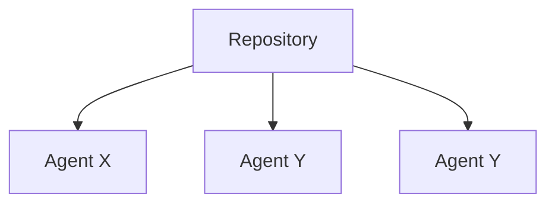

# Architecture

This document defines the Directory protocol, including the data models, services, and interfaces.
It serves as a technical document on the specification and implementation of the protocol.

## Data Models

Directory uses **Merkle-DAG data structure** to represent the objects across the system.
This ensures the objects that Directory deals with to be:

- authenticated - objects can be hashed and verified against the link
- permanent - once fetched, objects can be cached forever
- universal - any data structure can be represented as a Merkle-DAG
- decentralized - objects can be created by anyone, without centralized writers

In turn, these yield properties for the system as a whole:
- links are content addressed
- objects can be served by untrusted agents
- objects can be cached permanently
- objects can be created and used offline
- networks can be partitioned and merged
- any data structure can be modelled and distributed

Currently, Directory nodes support `sha2-256` hashing algorithm(s) to construct a Merkle-DAG.

### Agent Data Model

Below is a diagram that describes how the Agent Data model is represented in a form of a Merkle-DAG object.

Property key schema:
- Versioned agent: `/agents/{namespace}/{agent-name}/digests/{digest}`
- Released agent: `/agents/{namespace}/{agent-name}/tags/{tag}` link to a digest

Operations on the object:
- List all agents: `List("/agents/{namespace}/{agent-name}/digest")`
- List all released agents: `List("/agents/{namespace}/{agent-name}/tags:")`


### Distribution API

- ID: `/dir/{cid}`
- Schema: https://github.com/multiformats/cid

```go
	// Create a cid manually by specifying the 'prefix' parameters
	pref := cid.Prefix{
		Version:  1,
		Codec:    uint64(mc.Raw),
		MhType:   mh.SHA2_256,
		MhLength: -1, // default length
	}

	// And then feed it some data
	c, err := pref.Sum([]byte(`{"key": "value"}`))
	if err != nil {
		panic(err)
	}
```

```mermaid


```


## Network Model

The Directory network uses PKI based identity. A "dir node" is a program that can find, publish, and
replicate Merkle-DAG objects. Its identity is defined by a private key.

## Title C


