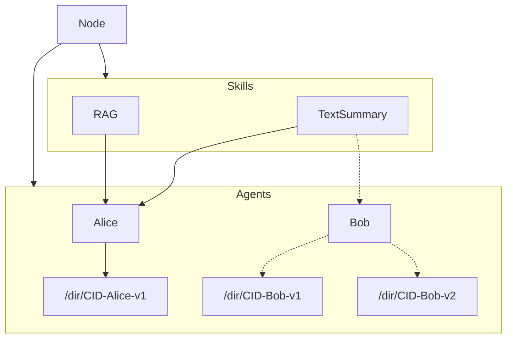

# Architecture

This document defines the Directory protocol, including the data models, services, and interfaces.
It serves as a technical document on the specification and implementation of the protocol.

<!-- TOC -->
* [Data Models](#data-models)
  * [Structure](#structure-)
  * [Schema](#schema)
* [Storage](#storage)
  * [Content digest](#content-digest)
* [Network](#network)
* [Routing](#routing)
  * [Announcement](#announcement)
  * [Discovery](#discovery)
  * [Routing Tables](#routing-tables)
  * [Naming & Namespacing](#naming--namespacing)
* [Bootstrapping](#bootstrapping)
* [Stack](#stack)
* [Considerations](#considerations)
  * [Replication](#replication)
  * [Availability](#availability)
  * [Security](#security)
  * [Performances](#performances)
  * [TODO](#todo)
<!-- TOC -->

---

## Data Models

### Structure 

Implementations MUST use a **self-verifying data structure** to represent the objects stored and distributed across the system.
This ensures the objects that the Directory deals with to have the following properties:

- **authenticated** -- objects can be hashed and verified against the link
- **permanent** -- once fetched, objects can be cached forever
- **universal** -- any data structure can be represented as a Merkle-DAG
- **decentralized** -- objects can be created by anyone, without centralized writers

In turn, these yield properties for the system as a whole:
- links are content addressed
- objects can be served by untrusted agents
- objects can be cached permanently
- objects can be created and used offline
- networks can be partitioned and merged
- any data structure can be modelled and distributed

The current implementation of the Directory uses Merkle-DAGs and Merkle-CRDTs as the underlying data structures.
See more in the [Merkle-DAGs/CRDTs](https://research.protocol.ai/publications/merkle-crdts-merkle-dags-meet-crdts/psaras2020.pdf) research papers.

### Schema

Data models MUST conform to the **Agent Data Model schema** defined in the [Open Agent Schema Framework](https://schema.oasf.agntcy.org/).
The data models currently used across the system are defined in [api/core](api/core/v1alpha1).

## Storage

Implementations MUST expose a **content-addressable storage interface** that allows:

- **publication** -- objects can be pushed and stored permanently
- **retrieval** -- objects can be accessed and pulled using only the content digest
- **lookup** -- associated metadata can be accessed without pulling in the whole object
- **verification** -- objects can be verified against the content digest
- **removal** -- objects can be removed from the storage

Nodes participating in the network MAY have control on who can access this interface,
either the whole network, a subset of other nodes based on some policies, or no one.
It is the responsibility of the storage layer to serve these operations
efficiently by taking into account the requirements such as data availability, replication, etc.

The storage system can be satisfied with various kinds of implementations.
The current implementation of the Directory uses an OCI Registry for storage.
See more in the [OCI Distribution](https://github.com/opencontainers/distribution-spec) specs.
The interface currently used across the system is defined in [api/store](api/store).

### Content digest

The content digest MUST be generated using a [cryptographic hash function](https://en.wikipedia.org/wiki/Cryptographic_hash_function).
The purpose of the digest is to serve as a **global identifier of arbitrary data** on the storage layer.
An example of calculating content digest in Golang using SHA-256 hashing function can be found in [go-cid](https://github.com/ipfs/go-cid#creating-a-cid-from-scratch) package.

The current implementation of the Directory uses CID as a default standard when dealing with content digests.
See more in the [Content Identity](https://github.com/multiformats/cid) specs.

## Network

The Directory network MUST use a cryptographically strong identity.
A "dir node" is a program that can publish, find, and replicate objects across the network. 
Its identity is defined by a private key.

The node MAY be allowed to work in one of the following **modes of operation**:
- **client** -- The node can interact with the public network, but it does not expose any interfaces to it.
The interfaces can be exposed only to the local network.
- **swarm** -- The node exposes all its interfaces to a subset of nodes on the network.
- **server** -- The node exposes all its interfaces to the public network.

All interfaces and operations on the network MUST be provided and performed by the node itself.

## Routing

Implementations MUST expose a **routing interface** that allows the **announcement and discovery** of agent records across the network.
The routing layer serves two important purposes:

- peer routing -- to find and connect with other nodes on the network
- content routing -- to find the data published across the network

The routing system can be satisfied with various kinds of implementations.
The current implementation of the Directory uses DHT (distributed hash table) for routing.
See more in the [libp2p](https://github.com/libp2p/specs) specs.
The interface currently used across the system is defined in [api/routing](api/routing).

### Announcement

The nodes participating in the network MUST be able to **receive the announcement events** when
the new data is published to the network to be able to update their routing tables.
Nodes MAY also optionally pull the data if needed from the node that sent the event.

The minimal interface required to implement the Announcement API consists of a method that broadcasts locally available Agent data models to the rest of the network.
For example, `Announce(node routing.Node, model core.ObjectRef)`.

### Discovery

The nodes participating in the network MUST be able to **find published contents**.
The minimal interface required to implement the Discovery API consists of two sub-interfaces
for querying and traversing the objects on a given node based on:

- **Discovery By Name**
  - `List(path=/agents)` -- returns a list of unique agent names
  - `List(path=/agents/{agent})` -- returns a list of all release digests associated with a given agent

- **Discovery By Skill**
  - `List(path=/skills)` -- returns a list of unique skill names
  - `List(path=/skills/{skill})` -- returns a list of unique agent names that have a release with a given skill

Implementations MAY allow more granular querying logic for the Discovery API.

### Routing Tables

Clients SHOULD first query the Skill Routing Table to find which agents have a given skill,
and then query the releases for a given agent using the Agent Routing Table.

Note that each skill only points to the agent name (or subgraph) rather than having all the digests for all agents. 
This is to prevent creating record duplications between the two graphs.
An agent with a given skill can be traversed using Agent Routing table
once we know that the given agent has a release that contains a given skill.

### Naming & Namespacing

Define more details on the APIs that will serve the Routing using path-based traversal.

## Bootstrapping

Define how the nodes should initialize their storage data, routing data, and
connect with the rest of the network.

## Stack

Below is an architecture diagram of the current system that implements the Directory protocol and the full interface described above.

## Considerations

### Replication

### Availability

### Security

### Performances

---

List of items to be done:
  - Add RFC template
  - Add some mathematical estimates for network and data size
  - Provide system requirements
  - Dual DHT considerations (WAN/LAN vs Content-Specific)
