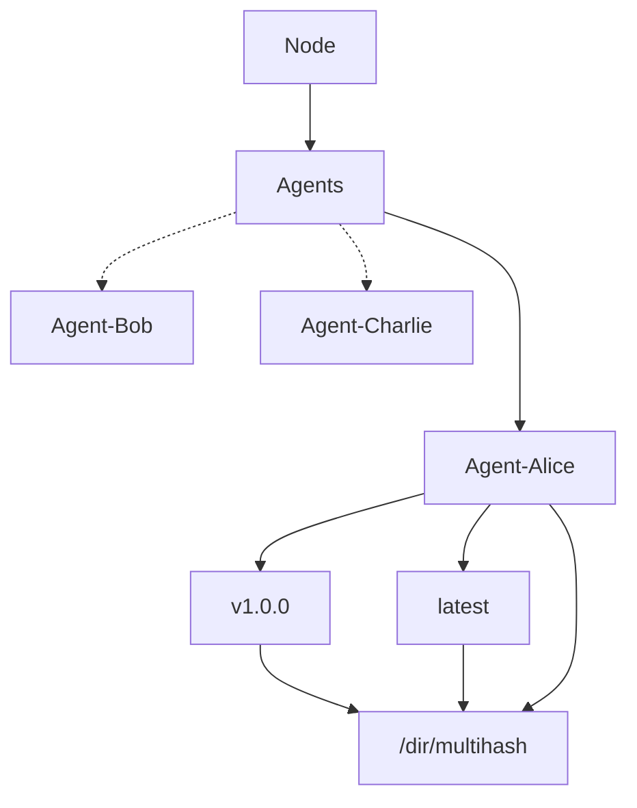
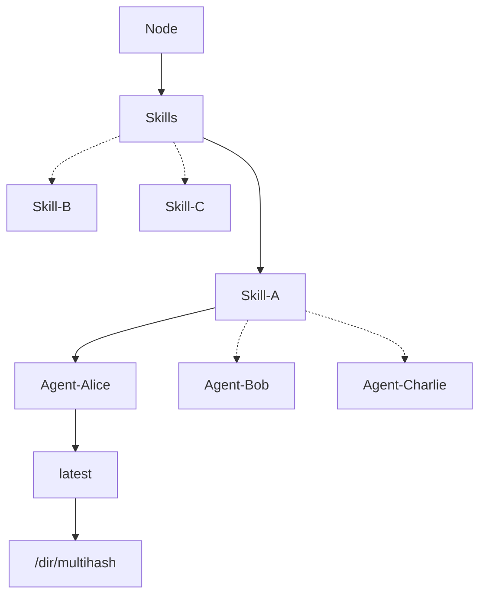

# Architecture

This document defines the Directory protocol, including the data models, services, and interfaces.
It serves as a technical document on the specification and implementation of the protocol.

## Data Models

Directory uses **Merkle-DAG data structure** to represent the objects distributed across the system.
This ensures the objects that Directory deals with to have the following properties:

- authenticated - objects can be hashed and verified against the link
- permanent - once fetched, objects can be cached forever
- universal - any data structure can be represented as a Merkle-DAG
- decentralized - objects can be created by anyone, without centralized writers

In turn, these yield properties for the system as a whole:
- links are content addressed
- objects can be served by untrusted agents
- objects can be cached permanently
- objects can be created and used offline
- networks can be partitioned and merged
- any data structure can be modelled and distributed

The references to the data models currently used across the project can be found in [api/core](api/core/v1alpha1).

## Storage

Each node implements a **content-addressable storage interface** that allows:

- publication - objects can be pushed and stored permanently
- retrieval - objects can be accessed and pulled using only the content digest
- verification - objects can be verified against the content digest

Nodes participating in the network have full control on who can access this interface,
either the whole network, a subset of other nodes based on some policies, or no one.
It is the responsibility of the storage layer to serve these operations
efficiently by taking into account the data availability, replication, etc.

The content digest is generated by calculating its multihash using https://github.com/ipfs/go-cid.
An example of calculating content digest in Golang using SHA-256 hashing algorithm is provided below.

```go
package main

import (
  "fmt"
  
  cid "github.com/ipfs/go-cid"
  mc "github.com/multiformats/go-multicodec"
  mh "github.com/multiformats/go-multihash"
)

func main() {
  // Create a cid manually by specifying the 'prefix' parameters
  pref := cid.Prefix{
    Version:  1,
    Codec:    uint64(mc.Raw),
    MhType:   mh.SHA2_256,
    MhLength: -1, // default length
  }
  
  // And then feed it some data
  c, err := pref.Sum([]byte("Hello World!"))
  if err != nil {
    panic(err)
  }
  
  fmt.Println("Created CID: ", c)
}
```

## Network

The Directory network uses PKI based identity. A "dir node" is a program that can find, publish, and
replicate Merkle-DAG objects. Its identity is defined by a private key.

## Routing

The Routing layer serves two important purposes:

- **peer routing** -- to find other nodes
- **content routing** -- to find data published to the storage layer

The routing system can be satisfied with various kinds of implementations.
Current implementation of the Directory uses DHT (distributed hash table) for routing.
See more in the [libp2p](https://github.com/libp2p/specs) specs.

### Bootstrapping

Define how the nodes should initialize their routing data and
connect with the rest of the network.

### Announcement

The nodes participating in the network wait for the announcement event to be broadcasted
in order to update their routing table and optionally to pull the contents from the broadcast node.

The minimal interface required to implement the Discovery API:
- `Announce(Node, Agent Data Model)` - broadcasts locally available `Agent` data model to the network.

### Discovery

Other nodes may query the network to find both the published agent records,
but also the nodes serving that content. 
This is handled using the underlying DHT routing tables.

The minimal interface required to implement the Discovery API:
- `List(path=/agents)` - returns a list of unique agent names
- `List(path=/agents/{agent})` - returns a list of tags and digests associated with a given agent
- `List(path=/skills)` - returns a list of unique skill names
- `List(path=/skills/{skill})` - returns a list of unique agent names associated with a given skill

Implementations may allow more granular querying logic on the Discovery API.

#### Agent Routing Table



Supported operations on the node serving the Agent routing table:
- List all agents - `List /{node}/agents` - returns a list of unique agent names
- List all releases for a given agent - `LIST /{node}/agents/{agent}` - returns a list of agent tags and digests

Note that each agent has a `latest` tag which points to the last announcement event.

#### Skill Routing Table



Supported operations on the node serving the Skill routing table:
- List all skills - `List /{node}/skills` - returns a list of unique skill names
- List all agents for a given skill - `LIST /{node}/skills/{skill}` - returns a list of unique agent names

Note that the implementations can decide to serve the Agent routing table via the Skill routing table.
For example, agent list operations can be performed using Skill subtree matching that agent name without traversing all the tags and digests for a single agent collection.
