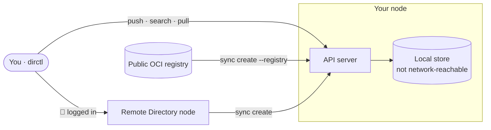
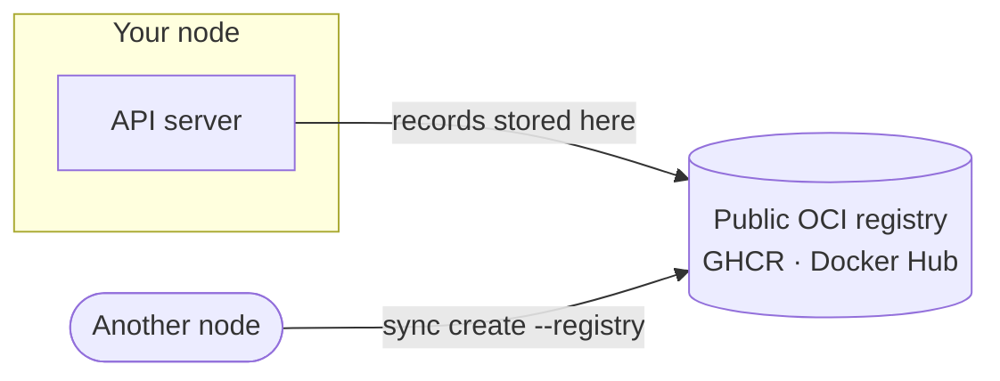
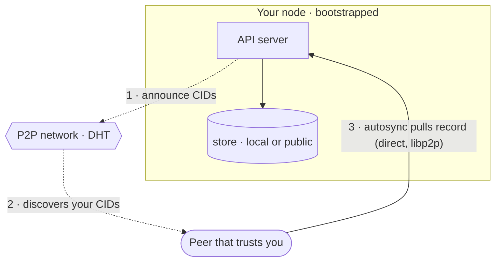
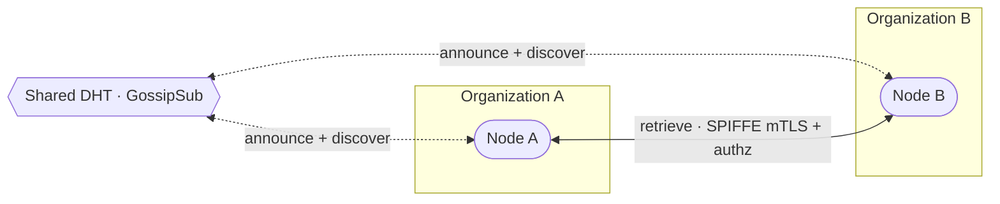

# Choosing Your Directory Setup

Not sure which Directory setup you need? Walk through the questions below, then find the
matching configuration — each shown as its own topology.

  <ol>
    <li><strong>Who needs to discover your records?</strong> Only you → keep going · your team or organization → <em>Networked</em> · other organizations → <em>Federated</em>.</li>
    <li><strong>(Only you) Should others be able to pull them from a public registry?</strong> No → <em>Private</em> · Yes → <em>Public-store</em>.</li>
  </ol>

## Recommended configurations

The configurations below cover the useful combinations. In every diagram
dashed lines mean discovery (only CIDs/labels move), solid lines mean retrieval (record bytes move).

### Private node { #private-node }

Keep records to yourself. Store locally, no network.

You store, search, sign, and pull locally. You can still pull records
inbound, both from a public registry and from a remote Directory node you authenticate to.

What stays true either way: nobody else can discover or retrieve **your** records.

Choose when:

- Discovery = only you
- Store = bundled/local

See [Local Deployment](dir-deployment-local.md) for more details.

### Public-store node { #public-store-node }

Let others retrieve, without a network.

The store is a public registry (GHCR, Docker Hub). Anyone who knows the registry can pull
records straight from it — a specific CID or all of them — with `dirctl sync create
--registry`; your node need not even be online. This still isn't network discovery: there's no
DHT, so consumers point sync at your registry rather than finding you across a network.

Choose when:

- Discovery = only you
- Store = public registry

See [Local Deployment](dir-deployment-local.md) and [Store](dir-component-store.md) for more details.

### Networked node { #networked-node }

Be discoverable.

A bootstrap connection puts the node on the DHT: it announces its records and can search
for records held by other nodes.

Being networked also enables autosync — direct node-to-node transfer over libp2p. Autosync
is receiver-controlled: each node automatically pulls only from the peers in its own
trusted allow-list. So you autosync records from peers you list, and a peer that lists
you autosyncs yours. It is opt-in and off by default.

Because it is receiver-controlled, your own autosync setting changes what you can pull in —
not what others can take from you:

| Your store | Your autosync | Can others retrieve your records? | Can you retrieve others' records? |
|---|:--:|---|---|
| Local | off | Only a peer that lists you in its own allow-list, over libp2p | On-demand `sync create` only |
| Local | on | Same — your autosync does not change this | Yes, from peers in your own allow-list (+ on-demand) |
| Public | off | Yes — anyone pulls from the registry | On-demand `sync create` only |
| Public | on | Yes — anyone pulls from the registry | Yes, from peers in your own allow-list (+ on-demand) |

*Choose when:*

- Discovery = within your team or organization
- Store = local or public

See [Local Deployment](dir-deployment-local.md), [Connecting to a Remote Directory](dir-deployment-local.md#connecting-to-a-remote-directory), and [Routing](dir-component-routing.md) for more details.

### Federated { #federated }

Exchange across organizations.

Multiple production nodes peer under a shared trust root. Organizations discover each
other's records over a shared DHT and retrieve them with authenticated, authorized access
(SPIFFE mTLS + authorization policies). Establishing that shared trust root takes a one-time
SPIRE federation step, where each organization's SPIRE server exchanges trust bundles with
the others (see [Federation Bundle Profiles](dir-federation-profiles.md)).

Choose when:

- Discovery = other organizations

See [Federation](dir-federation-overview.md) and [Trust Model](dir-component-trust-model.md) for more details.
