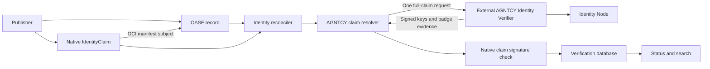
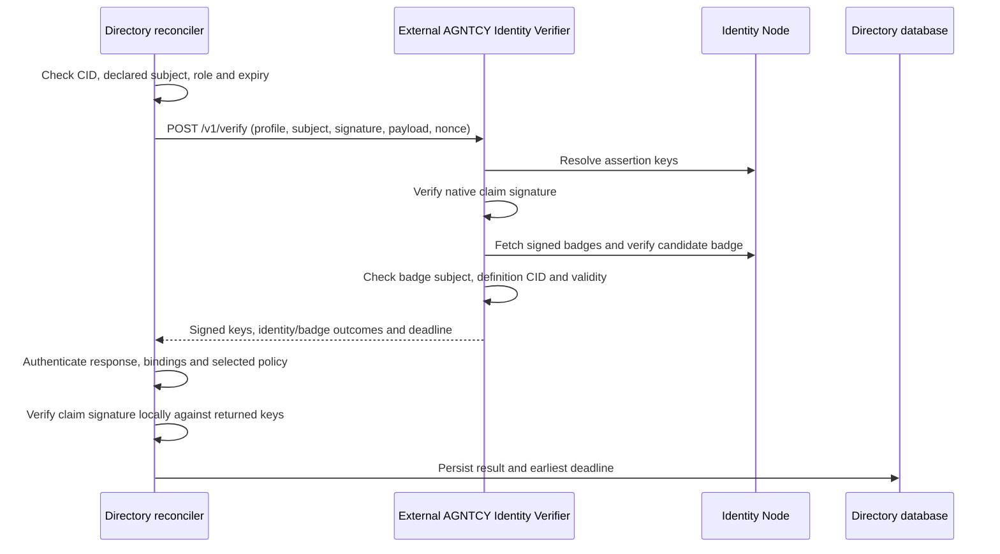
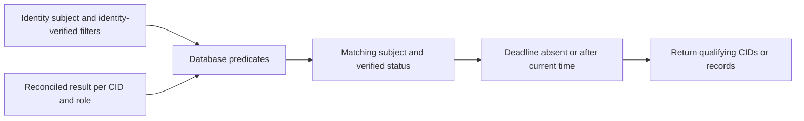

# AGNTCY Identity Claims (experimental)

An AGNTCY identity is declared in the record's `agntcy.dir/identity` annotation:

```json
{
  "annotations": {
    "agntcy.dir/identity": "agntcy://AGNTCY-security-autonomous-agent"
  }
}
```

The record declares one identity and may have multiple signed claims. The identity
reconciler checks an applicable claim's agent signature and, by default, requires
an Agent Badge that binds that Agent ID to the exact record CID. Verification is
asynchronous; pushing a claim does not make the record verified.

This integration adapts the
[reference implementation](https://github.com/agntcy/agent-identity-demos/tree/2c891480a8afe7fdba2e22955e1c9f4d3fcd69ed/identity-claim-agent-badge-poc)
to Directory's current public-key resolver and canonical claim payload. See
[proposal #2291](https://github.com/agntcy/dir/issues/2291).

## Architecture and storage



| Object | Location |
|---|---|
| Record and identity annotation | Directory content store |
| Signed claim | Native OCI referrer, type `agntcy.dir.identity.v1.IdentityClaim` |
| Signed Agent Badge and public-key metadata | AGNTCY Identity Node |
| Verification result and deadline | Directory database |

The claim is JSON in a `RecordReferrer`. The OCI referrer's manifest `subject`
references the record's manifest. This uses the existing claim schema and storage
APIs. The claim contains the Agent ID as its resolution reference; it has no badge
or badge URL field. The Identity Node hosts the actual signed badge.

The `agntcy://` suffix is a case-sensitive Agent ID of 1–512 ASCII letters, digits,
`-`, `_`, `.`, or `~`. `.` and `..` are rejected. Paths, ports, user information,
percent escapes, queries, and fragments are rejected. URLs come from operator
configuration; an Agent ID cannot select a network endpoint.

## Verification contracts

The resolver implements the existing contract:

```go
Resolve(ctx context.Context, subject string, certificate []byte) ([]crypto.PublicKey, error)
```

`Resolve` returns authenticated agent keys. Directory verifies the detached JWS
against those keys using its native signature verifier. No certificate is allowed
on an AGNTCY claim. The canonical payload signs `record_cid`, `role`, `subject`,
`signed_at`, and `expires_at`, in that order; an absent expiry is an empty string.

`Resolve` keeps the standard resolver interface for key-only callers. It is not
called during AGNTCY claim reconciliation. An optional record-aware extension
returns the authorized keys and a deadline together:

```go
ResolveClaim(ctx context.Context, claim *identityv1.Claim) (identity.ClaimResolution, error)
```

The reconciler invokes this extension once for each candidate AGNTCY claim,
authenticates its signed response, then verifies the native claim locally against
the returned keys. DID and SPIFFE continue using `Resolve`. Combined evidence is
never cached by subject: a result for one CID cannot verify another record sharing
the Agent ID.



The experimental HTTP protocol is `agntcy.identity-verification.v2`.
`POST /v1/verify` returns `{ "resultJws": "<compact embedded JWS>" }`.
The signed result includes operation kind, verifier ID, profile, policy version,
`checks.identity`, `checks.badge`, aggregate outcome, authorized public JWKs,
subject, exact record CID, SHA-256 digest of the compact request JSON, check time,
and expiry. Each request includes a fresh random nonce covered by the digest.
The digest also covers the requested profile, canonical claim payload and agent
signature. Directory rejects v1 responses and incomplete v2 evidence.

The service may expose `/v1/resolve` for key-only callers; Directory's AGNTCY
reconciler uses only the combined `/v1/verify` operation. One Directory request can
require multiple internal Identity Node API calls.

Directory pins the service's response-signing keys, checks every binding, rejects
stale or expired results, and derives signature algorithms from the trusted keys.
HTTP success alone cannot establish verification. Redirects are disabled.

### Badge policy and implementation limits

The companion Identity verifier uses profile `agntcy-agent-badge.v1` and policy
`subject-key-badge.v1`. It delegates credential verification to the configured
Identity Node, then requires `AgentBadge` type, exact `credentialSubject.id`, and
an embedded `credentialSubject.badge` whose Directory CID matches the claim.
It also enforces supplied credential/JWT start and expiry fields.

This policy names the reference Identity Node's subject-key-backed verification.
It establishes agent control and badge/record consistency. Independent issuer
authorization and credential revocation/status-list processing need a separately
defined policy and implementation before production adoption. This service does
not implement them. The verifier's result key is loaded from a PEM file; KMS/HSM
result signing is also a future integration.

## Reconciler configuration

```yaml
reconciler:
  identity:
    enabled: true
    interval: 15m
    record_timeout: 1m
    agntcy:
      verifier_url: https://identity-verifier.example.com:8443
      verifier_trust_bundle_file: /etc/agntcy/verifier-keys.json
      verifier_id: agntcy-identity-verifier
      profile: agntcy-agent-badge.v1
      require_agent_badge: true
      bearer_token_file: /etc/agntcy/verifier-token
      request_timeout: 10s
      max_verification_age: 30m
```

The trust bundle is a public JWKS (multiple keys permit rotation) or one PEM
SubjectPublicKeyInfo public key. It authenticates service results and is separate
from the agent keys and HTTPS CA trust. Trust and token files are reloaded at the
start of each reconciliation run. Invalid configuration fails AGNTCY verification
without blocking other schemes. `require_agent_badge` defaults to `true`; disabling
it establishes only control of the declared identity. The pinned service ID
defaults to `agntcy-identity-verifier`.

The included service requires bearer authentication. The resolver can instead use
an injected authenticated HTTP client when embedded by an operator; daemon
configuration should provide `bearer_token_file` for this service. HTTPS CA trust
uses Go's system roots; private deployments can provide `SSL_CERT_FILE` or
`SSL_CERT_DIR` in the process environment.

### Deploying the external verifier

The verifier belongs to the AGNTCY Identity deployment. Directory contains the
client adapter and reconciliation wiring. Configure its URL, response-signing
trust bundle, authentication, profile and time limits as shown above.

The companion module in `agntcy/identity`, `integrations/directory-verifier`,
contains the service, Dockerfile and deployment instructions. It uses the Node's
`/v1alpha1/id/resolve`, `/v1alpha1/vc/<agent-id>/.well-known/vcs.json`, and
`/v1alpha1/vc/verify` APIs. Only keys referenced by `assertionMethod` are accepted.

The feature is optional: without `agntcy.verifier_url`, AGNTCY claims fail closed
and other resolver schemes keep their existing behavior. Badge verification is
required by default. Explicitly setting `require_agent_badge: false` selects the
`agntcy-agent-control.v1` profile, which establishes identity control only and does
not fetch badges. A mismatched configured profile is rejected.

## Freshness and search

Each verified result has an optional `valid_until` database column. The AGNTCY
deadline is the earliest of claim expiry, combined-result expiry, and the configured maximum
verification age. Combined-result expiry is also bounded by the matching badge's
expiry. Every accepted AGNTCY result must have a deadline.
Schedule reconciliation frequently enough to renew before it.

An outage may preserve the previous observation only until its deadline and the
existing seven-day transient grace. Expired results are reported as failed by
status reads and excluded by verified search immediately, even between runs.
Authoritative rejections such as withdrawn keys or missing valid badges fail
verification. Withdrawn claims remove the stored result on reconciliation.
The column is added by the existing database auto-migration; existing rows with a
null deadline retain their previous behavior. `valid_until` is internal to the
database and is not added to the protobuf response in this draft.

```bash
dirctl identity claim --record <cid> --role identity --key agent.key
dirctl identity status <cid> --output json
dirctl search --identity 'agntcy://*' --identity-verified
dirctl search --identity 'agntcy://AGNTCY-security-autonomous-agent' --identity-verified
```

API search combines `RECORD_QUERY_TYPE_IDENTITY` with
`RECORD_QUERY_TYPE_IDENTITY_VERIFIED` set to `true`. The generic `VERIFIED` filter
refers to ownership. A subject filter alone does not establish verification; it
matches reconciled identity rows, including failures.



Search reads persisted results and checks deadlines. It does not contact the
Identity Node or scan OCI claims per request. Each record version has its own CID
and result; verifying one version does not verify all versions of an Agent ID.
