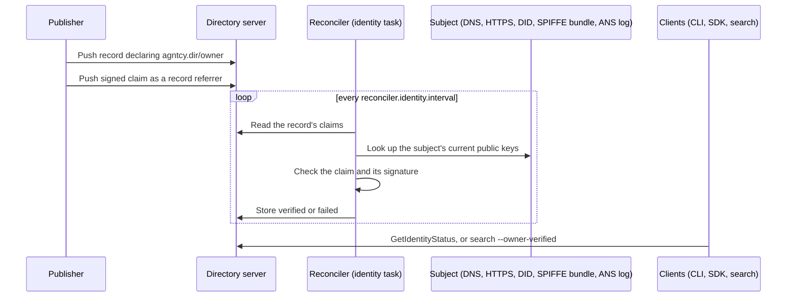

# Identity and Ownership Claims

A record can carry two signed claims: one for the identity of the record itself and one
for the owner behind it. A claim ties the record to a subject (a domain, a DID, a SPIFFE ID
or an ANS name) and is proven with a signature that anyone can check against key material the
subject publishes, or against a certificate the claim carries. The reconciler verifies every
claim on a schedule and stores the outcome, so a rotated key, a revoked trust bundle or a
revoked agent shows up on the next run.

This page describes the claim schema, how each kind of subject is verified, and how to read
the results. For the commands, see [CLI Reference — Identity](dir-cli-reference.md#dirctl-identity-claim-flags);
for a walkthrough, see [Usage Guide — Identity and Ownership Claims](dir-features-scenarios.md#identity-and-ownership-claims).

## How it works



1. The record declares the subject it claims in its `agntcy.dir/identity` and
   `agntcy.dir/owner` annotations.
2. The publisher signs a claim for that subject with a private key whose public half the
   subject publishes, and attaches it to the record as an OCI referrer.
3. The reconciler's `identity` task verifies the claim: it resolves the subject's current
   keys and checks the signature against them. The result is stored in the server database.
4. The server reports the result through the `IdentityService` API, `dirctl identity status`
   and the search filters.

A claim is never verified at the time it is pushed. Until the task has run, the claim has
`no result`.

## Declaring the subject

A claim is only evaluated against the subject its record declares. The declaration is part of
the record, so it is covered by the record's CID and cannot be changed afterwards.

| Annotation | Role | Meaning |
|------------|------|---------|
| `agntcy.dir/identity` | `identity` | The record's own claimed identity |
| `agntcy.dir/owner` | `owner` | The entity that owns the record |

```json
{
  "name": "example.com/agents/research-assistant",
  "version": "v1.0.0",
  "annotations": {
    "agntcy.dir/identity": "did:web:example.com:agents:research-assistant",
    "agntcy.dir/owner": "dns:example.com"
  }
}
```

A record may declare one, both or neither. A claim for a role the record does not declare is
refused when it is created with `dirctl identity claim` or the SDK, and is ignored by the
reconciler if it is pushed by hand.

## Names

A record's `name` field is how it is referenced as `name`, `name:version` or
`name:version@cid`. A name is a label chosen by the publisher and is not verified. The
claims on this page are what prove who stands behind a record.

## Claim schema

A claim is the `agntcy.dir.identity.v1.Claim` message. It is stored as a
[record referrer](dir-component-store.md) of the record it is about, with the message encoded
as JSON in the referrer's data.

| Field | Type | Description |
|-------|------|-------------|
| `role` | `ClaimRole` | `CLAIM_ROLE_IDENTITY` or `CLAIM_ROLE_OWNER` |
| `recordCid` | string | CID of the record the claim is attached to |
| `subject` | string | The identity URI being claimed; must equal the record's annotation for the role |
| `signedAt` | string | RFC 3339 signing time |
| `expiresAt` | string, optional | RFC 3339 expiry; an expired claim fails |
| `signature` | string | Detached JWS (RFC 7515) in compact serialization |
| `certificate` | string, optional | Base64 DER X.509 certificate; only for `spiffe://` and `ans://` subjects |

The referrer type follows the role:

| Role | Referrer type |
|------|---------------|
| `identity` | `agntcy.dir.identity.v1.IdentityClaim` |
| `owner` | `agntcy.dir.identity.v1.OwnershipClaim` |

```json
{
  "role": "CLAIM_ROLE_OWNER",
  "recordCid": "baeareie...",
  "subject": "dns:example.com",
  "signedAt": "2026-10-02T10:15:00Z",
  "expiresAt": "2027-10-02T10:15:00Z",
  "signature": "eyJhbGciOiJFUzI1NiJ9..<signature>"
}
```

### What is signed

The signature covers a canonical JSON payload of five fields, in this order:

```json
{"record_cid":"...","role":"CLAIM_ROLE_OWNER","subject":"dns:example.com","signed_at":"...","expires_at":"..."}
```

`expires_at` is the empty string when the claim does not expire. Because the CID and the role
are signed, a claim cannot be replayed against another record or presented as the other role.
The `signature` and `certificate` fields are not part of the payload.

!!! warning

    The certificate is not covered by the signature. For that reason it is only accepted
    on a `spiffe://` or `ans://` claim, where it is validated on its own (against a trust
    bundle, or against the agent's transparency log), and a claim for any other subject that
    carries one fails.

### Signing keys

The signature algorithm is chosen from the public key, never from the JWS header, so a claim
cannot pick its own verification algorithm.

| Key | JWS algorithm |
|-----|---------------|
| ECDSA P-256 | `ES256` |
| ECDSA P-384 | `ES384` |
| Ed25519 | `EdDSA` |
| RSA, 2048 bits or more | `RS256` |

## Subjects and key publication

The scheme of the subject decides how its keys are found. A claim verifies when any one of
the keys the subject currently publishes validates its signature.

| Subject | Where the key comes from |
|---------|--------------------------|
| `dns:example.com`, or a bare `example.com` | TXT record at `_agntcy-key.example.com` |
| `https://example.com` | `https://example.com/.well-known/jwks.json` |
| `did:web:example.com` | `https://example.com/.well-known/did.json` |
| `did:web:example.com:agents:finance` | `https://example.com/agents/finance/did.json` |
| `did:key:z...` | The key encoded in the DID itself; no network access |
| `spiffe://example.com/agents/finance` | The SVID in the claim, validated against a configured trust bundle |
| `ans://v1.0.0.agent.example.com` | The identity certificate in the claim, once the agent's transparency log attests it |

Any other scheme, such as `http://` or `mailto:`, is not supported and fails the claim.

### DNS

Publish one TXT record per key at `_agntcy-key.<domain>`:

```text
_agntcy-key.example.com.  300  IN  TXT  "v=akv1;key=<base64 DER SubjectPublicKeyInfo>"
```

The value is the standard base64 of the key's DER `SubjectPublicKeyInfo`, which is what
`openssl pkey -pubout -outform DER` produces. Records that are not a well-formed `akv1` record
are skipped.

### HTTPS and JWKS

For an `https://` subject the verifier fetches `/.well-known/jwks.json` from the subject's
host, over HTTPS only, and uses every key in the [JWK set](https://www.rfc-editor.org/rfc/rfc7517).
A subject with a user-info part, such as `https://example.com@evil.example`, is refused.

### DID

For `did:web` the document is fetched from the location the [did:web method](https://w3c-ccg.github.io/did-method-web/)
defines. A document is only accepted when its `id` equals the subject. Only keys listed under
`assertionMethod` count, whether embedded or referenced from `verificationMethod`; a key that
the document lists only as key material is not authorized to make assertions. Keys are read from
`publicKeyJwk`.

A `did:key` subject carries its key, so it needs no network access. P-256, P-384, Ed25519 and
RSA keys are supported.

### SPIFFE

A `spiffe://` claim carries the signer's X.509-SVID in `certificate`, and no key is published
anywhere. The verifier accepts the claim only when the certificate fulfils the following conditions:

- Chains to the trust bundle configured for the subject's trust domain.
- Has a URI SAN equal to the subject.
- Is within its validity period.

The claim carries only the leaf certificate, so its issuer must be a root in the bundle. A
trust domain with no configured bundle fails. See
[Configuration](#configuration) for how to provide the bundles.

### ANS

An `ans://` subject is an agent registered with the Agent Name Service (ANS), written
`ans://v<major>.<minor>.<patch>.<host>` in exactly that spelling: a lowercase host and a
version without leading zeros. The claim carries the agent's identity certificate in
`certificate`, and no key is published anywhere. The verifier accepts the claim only when all
of the following hold:

- The certificate has a URI SAN equal to the subject, is within its validity period, and the
  claim's signature verifies against its key.
- The TXT record at `_ans-badge.<host>` names the agent's transparency log, and that log is
  one of the configured `trusted_log_hosts`. The record has the form
  `v=ans-badge1; version=v1.0.0; url=https://<log host>/v1/agents/<uuid>`; one without a
  `version` applies to every version of the agent. The record is a pointer only; nothing in it
  is trusted.
- The log's status token for the agent verifies with the log's signing keys, names the
  subject, reports a status of `ACTIVE`, `WARNING` or `DEPRECATED`, and lists the
  certificate's SHA-256 fingerprint among the agent's valid identity certificates.

A `verified` result therefore means: the claim was signed by the key of the certificate it
carries; that certificate names the subject, is within its validity, and its fingerprint is
listed as a valid identity certificate in a status token signed by a trusted transparency
log for an agent whose name is the subject and whose status allows use. The certificate's
issuer chain is not checked, the DNS pointer is not trusted, and neither the log's receipt
nor its tree head is examined. With `allow_unpinned_root_keys`, the log's signing keys are
fetched over TLS from the trusted host, so the proof reduces to TLS plus the log's own
statement.

**Revocation and renewal.** Every run asks the log again, so a revoked or expired agent, or
a certificate the log no longer lists, fails on the next run that reaches the log, at most
`status_cache_ttl` later. A lookup that gets no answer keeps the stored result for
`ans.stale_grace` (default 24 hours) from the last run that reached the subject, as described
under [Unreachable subjects](#unreachable-subjects): a publisher who makes their own
`_ans-badge` lookup fail can delay the effect of a revocation by that long, so an operator who
wants to fail closed sets `ans.stale_grace` to a positive value below `interval`. A claim also
stops verifying when its certificate expires, whatever the log says, so the publisher has to
push a new claim after each certificate renewal.

**Failures.** What the publisher publishes is judged as it is. A subject that is not
canonical, a certificate that does not name it or is outside its validity, a `_ans-badge`
record that is missing, ambiguous or points outside `trusted_log_hosts`, or whose name does
not exist, and what the log states (a terminal status, a token for another agent, a
certificate it does not list, a 404, 401, 403 or any other answer that is not a 5xx, 408, 429
or a redirect) fail the claim for that run, whatever the stored result was. A lookup that gets
no answer, a DNS failure other than "no such name" or a trusted log that is down (a 5xx, 408
or 429 answer, a refused connection, a timeout, or a redirect, which the client never
follows), is treated as for every other scheme, with `ans.stale_grace` in place of the seven
days; see [Unreachable subjects](#unreachable-subjects). The stored error names the step that
failed, `ans name`, `ans certificate`, `ans badge` or `ans log`, after the reconciler's own
`resolve keys of <subject>:` prefix; a claim whose budget ran out while another claim's lookup
of the same subject was under way stores `ans: waiting for the lookup of <subject>`.

**The log's keys.** `root_keys` pins the logs' signing keys as the lines their `/root-keys`
endpoint serves. They are read at startup: when a log rotates its key, every `ans://` claim
fails, with the key id in the stored error, until `root_keys` is updated and the reconciler
restarted. Alternatively `allow_unpinned_root_keys` fetches each log's keys from
`/root-keys`, refreshed every `root_keys_ttl` and on a rotation, and trust then rests on TLS
to the trusted hosts. The two settings cannot be combined. A malformed `/root-keys` answer
fails the claims of that log for one run.

**Budget.** A lookup gets `timeout` for the DNS record and `timeout` again for the log, so
one `ans://` claim takes at most twice `timeout`, and `record_timeout` must allow for that.
The log's answer about a subject is reused for `status_cache_ttl` across the claims of that
subject, whatever certificates they carry, so a stack of claims attached to a record by
anyone costs one lookup. `status_cache_ttl` must be below `interval`.

The log is reached through the same SSRF-safe client as the other schemes, so a log on a
private address is refused at lookup time. Turning `ans.enabled` off, or running a
reconciler from before this scheme, fails `ans://` claims as an unsupported scheme on the
next run.

At startup the reconciler logs the trusted logs and the pinned key ids; during a run a kept
result is logged at `WARN` (`Keeping the last claim result`) and counted as `kept` in the
run summary, so a log outage shows up as kept results, and a key rotation the configuration
has not followed as `failed` results naming the key id.

### Fetch limits

Documents are fetched with an SSRF-safe client, because the URL comes from untrusted record
data. It speaks HTTPS only, refuses to connect to private, loopback, link-local and other
non-public addresses (checked after DNS resolution), follows at most three redirects, and
accepts responses of at most 1 MiB within a 10 second timeout. The ANS log client differs in
two ways: it never follows a redirect, and it accepts at most 64 KiB.

## Verification

The `identity` task of the [reconciler](dir-architecture.md) checks claims on a fixed interval.
For each record that carries claims, and for each role, it does the following:

- Selects the claims.

    A claim whose `subject` is not the one the record declares for the role is skipped. Anyone can attach a claim to any record, so such a claim says nothing about the record, and it leaves no result behind.

- Runs the checks that need no key.

    The claim is for this record (`recordCid`), it is not expired, `signedAt` parses, and the certificate rule holds (a certificate if and only if the subject is `spiffe://` or `ans://`). A claim that fails these costs no network lookup.

- Resolves the subject's current keys for its scheme.
- Verifies the signature against those keys.

If several claims of one role pass the selection, a verified claim decides the result,
whoever else attached claims. Otherwise the failure of the claim with the newest `signedAt` is
reported. A `signedAt` in the future, or one that does not parse, counts as the oldest, so a
forged date cannot outrank an honest claim.

Within one run a lookup is made once per subject, however many records share it.

### Results

| State | Meaning |
|-------|---------|
| `no result` | No claim of this role has been verified yet, or the claim no longer applies |
| `verified` | A claim for the declared subject verified against the keys the subject publishes |
| `failed` | Every claim for the declared subject failed; the reason is kept (up to 1,024 characters) |

A failed result always names the subject the record declares, never one a claim chose.
If a claim is withdrawn, or no claim applies any more, its stored result is removed. If a
record's claims cannot be read at all, the stored results are left as they were.

### Unreachable subjects

A failed lookup is not the same as a wrong claim. If the subject cannot be reached, because
of a timeout, a refused connection, a DNS failure other than "no such name", a 5xx, 408 or
429 response, or a redirect (which the client never follows), a result that is already stored
is left as it is, and nothing is written for that run. The result's age is counted from when
it was last written, so the grace lasts seven days from the last run that reached the subject.
After that, the next run that still cannot reach the subject stores a `failed` result with the
lookup error.

Two cases get no grace:

- A claim that has no stored result yet fails at once if its subject is unreachable on the first run, and verifies on the first run that reaches it.
- An answer that says the subject publishes no usable key, a `404`, a "no such host" or a
  blocked address is not transient, so it fails the claim immediately.

The seven days are fixed for every scheme but `ans://`, whose grace is `ans.stale_grace`
(default 24 hours; see [ANS](#ans)): the publisher's own DNS is among the lookups that may get
no answer, so a shorter window bounds how long a failing zone can hide a revocation, and a
positive value below `interval` keeps nothing. A run that is stopped mid-lookup stores no
failure for any scheme; the next run starts over from the stored result.

### Stored result

Each result is one row per record and role in the server database.

| Column | Description |
|--------|-------------|
| `record_cid` | Record the claim is about (primary key with `role`) |
| `role` | `identity` or `owner` |
| `subject` | The subject the record declares |
| `status` | `verified` or `failed` |
| `error` | Reason for a failure |
| `verified_at` | When the claim was last checked |

## Reading the results

### `IdentityService`

`GetIdentityStatus` returns the last result of a record's claims. A claim that has not been
verified is left unset, which is not an error. An unknown record is `NotFound`.

| Message | Fields |
|---------|--------|
| `GetIdentityStatusRequest` | `cid`, or `name` with an optional `version` |
| `GetIdentityStatusResponse` | `identity`, `owner` (each an optional `ClaimVerification`) |
| `ClaimVerification` | `role`, `subject`, `status`, `error` (only when failed), `verified_at` |

`ClaimVerificationStatus` is `CLAIM_VERIFICATION_STATUS_VERIFIED` or
`CLAIM_VERIFICATION_STATUS_FAILED`.

`Resolve` turns a record name, with an optional version, into the CIDs of the matching
records, newest first. It is read-only like the rest of the service: results are only written
by the reconciler.

### CLI and SDK

```bash
# Create the claim, then read the result
dirctl identity claim --record <cid> --role owner --key owner.key
dirctl identity status <cid> --output json

# Resolve a name
dirctl identity resolve example.com/agents/research-assistant
```

In Go, `ClaimIdentity` and `ClaimOwnership` create claims, and `GetIdentityStatus` and
`Resolve` read results; see the [Go SDK](dir-sdk-go.md#identity-resolve-and-verify-claims).

### Search

Records can be searched by the subject of their claims and by whether a claim verified:

```bash
dirctl search --owner 'dns:example.com'        # by subject (wildcards allowed)
dirctl search --identity 'did:web:example.com:*'
dirctl search --owner-verified                 # owner claim verified
dirctl search --identity-verified              # identity claim verified
dirctl search --verified                       # same as --owner-verified
dirctl search --trusted --verified             # signed and owner-verified
```

`--identity-verified` and `--owner-verified` only filter when set. `--verified` is tri-state:
`--verified=false` matches records without a verified owner. A subject filter matches the
subject the record declares. See
[CLI Reference — Search](dir-cli-reference.md#dirctl-search-query-flags) for all flags.

## Configuration

Claim verification is a reconciler task and is disabled by default. The `dirctl daemon`
default configuration enables it.

```yaml
reconciler:
  identity:
    enabled: true
    interval: 1h          # how often every claim is verified again
    record_timeout: 1m    # time allowed for all the claims of one record
    spiffe_trust_bundles:
      - trust_domain: example.org
        bundle_file: /etc/agntcy/spiffe/example.org.pem
    ans:
      enabled: true
      trusted_log_hosts:
        - log.example.com
      root_keys:
        - "example-log+1a2b3c4d+AjBZMBMGByqGSM49AgEGCCqGSM49AwEHA0IABF..."
      timeout: 10s
      status_cache_ttl: 30s
      stale_grace: 24h
```

| Key | Environment variable | Default | Description |
|-----|----------------------|---------|-------------|
| `enabled` | `RECONCILER_IDENTITY_ENABLED` | `false` | Run the task |
| `interval` | `RECONCILER_IDENTITY_INTERVAL` | `1h` | Time between runs |
| `record_timeout` | `RECONCILER_IDENTITY_RECORD_TIMEOUT` | `1m` | Time allowed for one record |
| `spiffe_trust_bundles` | none, YAML only | empty | Trust bundle per SPIFFE trust domain |
| `ans.enabled` | `RECONCILER_IDENTITY_ANS_ENABLED` | `false` | Verify `ans://` claims |
| `ans.trusted_log_hosts` | `RECONCILER_IDENTITY_ANS_TRUSTED_LOG_HOSTS`, comma-separated | empty | Transparency-log hosts (`host` or `host:port`) a badge record may point at |
| `ans.root_keys` | `RECONCILER_IDENTITY_ANS_ROOT_KEYS`, comma-separated | empty | The logs' signing keys, as the lines their `/root-keys` endpoint serves; required unless unpinned |
| `ans.allow_unpinned_root_keys` | `RECONCILER_IDENTITY_ANS_ALLOW_UNPINNED_ROOT_KEYS` | `false` | Fetch each log's keys from `/root-keys` instead; cannot be combined with `root_keys` |
| `ans.root_keys_ttl` | `RECONCILER_IDENTITY_ANS_ROOT_KEYS_TTL` | `10m` | How long fetched keys are used before they are fetched again |
| `ans.status_cache_ttl` | `RECONCILER_IDENTITY_ANS_STATUS_CACHE_TTL` | `30s` | How long a subject's attestation is reused; at least `5s`, below `interval` |
| `ans.stale_grace` | `RECONCILER_IDENTITY_ANS_STALE_GRACE` | `24h` | How long a stored result survives lookups that get no answer; unset or `0` means `24h`, and a positive value below `interval`, such as `1s`, keeps nothing |
| `ans.timeout` | `RECONCILER_IDENTITY_ANS_TIMEOUT` | `10s` | Time allowed for the DNS record, and again for the log; `record_timeout` must be at least four times this |
| `ans.clock_skew` | `RECONCILER_IDENTITY_ANS_CLOCK_SKEW` | `30s` | Tolerance on the status token's expiry, at most `10m` |

Each `spiffe_trust_bundles` entry has a `trust_domain` and a `bundle_file` holding the trust
domain's PEM root certificates. The files are read on every run, so a rotated or revoked bundle
applies on the next one. A bundle that cannot be read only fails the claims of its own trust
domain; the other domains and the run are not affected. With no bundle, `spiffe://` claims fail.

The `ans` block is checked at startup: a malformed host or root-key line, both `root_keys` and
`allow_unpinned_root_keys`, a `timeout` that does not fit `record_timeout` (a record may carry
an identity and an ownership claim, each taking two timeouts), a `status_cache_ttl` below `5s`
or not below `interval`, or a negative `stale_grace` stops the reconciler from starting, and under
`dirctl daemon` the API server with it. Under `dirctl daemon` the same keys take the
`DIRECTORY_DAEMON_RECONCILER_IDENTITY_ANS_` prefix.

## Security properties

- Anyone who can push a referrer can attach a claim to any record, so a result only comes from
  a claim that names the declared subject and verifies against that subject's own keys.
- The declared subject is part of the content-addressed record, so a claim cannot change who
  the record says it is about.
- The record CID and the role are signed, so a claim cannot be replayed against another record
  or as the other role.
- The signature algorithm is derived from the key, not from the claim, and RSA keys below 2048
  bits are rejected.
- A verified claim decides the result, whatever else is attached to the record.
- Claims are verified again on every run, so key rotation, DNS changes, a revoked trust bundle,
  a revoked ANS agent and expiry take effect on the next run that reaches the subject. A lookup
  that gets no answer keeps the stored result for the grace under
  [Unreachable subjects](#unreachable-subjects): seven days, or `ans.stale_grace` for `ans://`,
  which an operator sets below `interval` to fail closed.
- Keys are fetched with an SSRF-safe client, because the URLs come from record data.
