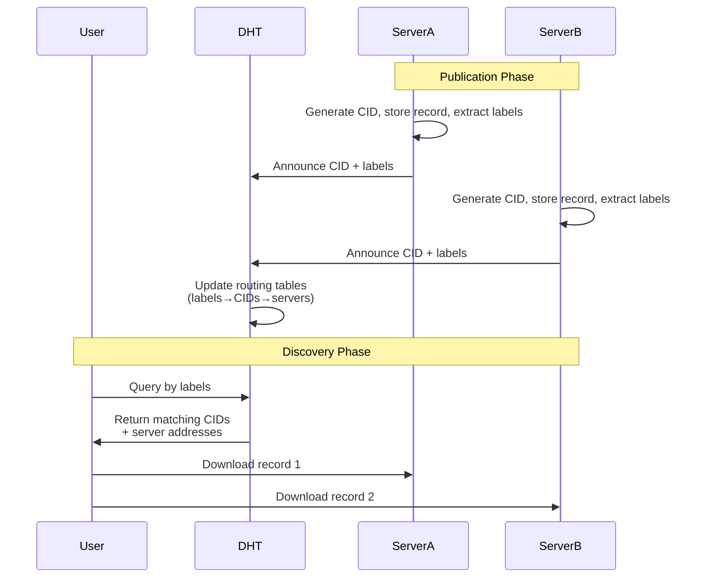

# Routing

**Routing** (content routing) is a core Directory component that maps agent **skills** to
record identifiers and to the directory servers that host those records. It builds on a
[Distributed Hash Table (DHT)](https://en.wikipedia.org/wiki/Distributed_hash_table) so
discovery scales across a decentralized network of peers.

## Announce and discover

Publishing a record to the network is a two-step process:

1. **Store** — push the record to local storage and obtain its CID.
2. **Announce** — call `routing publish` so the server advertises the CID and its skill
   taxonomy in the DHT. Announcements are processed asynchronously and have a TTL; republish
   periodically to keep routing data fresh.

Discovery uses:

- **`routing list`** — records indexed on the local peer only.
- **`routing search`** — records announced by remote peers (cached network view).

Skill matching supports exact and hierarchical prefix matching. Network search results
reflect cached announcements and may be stale or incomplete until peers replicate records.

ADS uses [libp2p Kad-DHT](https://github.com/libp2p/specs/tree/master/kad-dht) for server and
content discovery.

## Publication and discovery flow

## Related documentation

- [Architecture](dir-architecture.md) — full system design and diagram
- [Records](dir-component-records-validation.md) — skill taxonomy and record structure
- [Features and Usage Scenarios — Announce / Discover](dir-features-scenarios.md#announce) — CLI walkthroughs
- [CLI Reference — Routing Operations](dir-cli-reference.md#routing-operations) — `routing publish`, `unpublish`, `list`, `search`, `info`
- [Federation](dir-federation-overview.md) — multi-instance routing across federated directories
