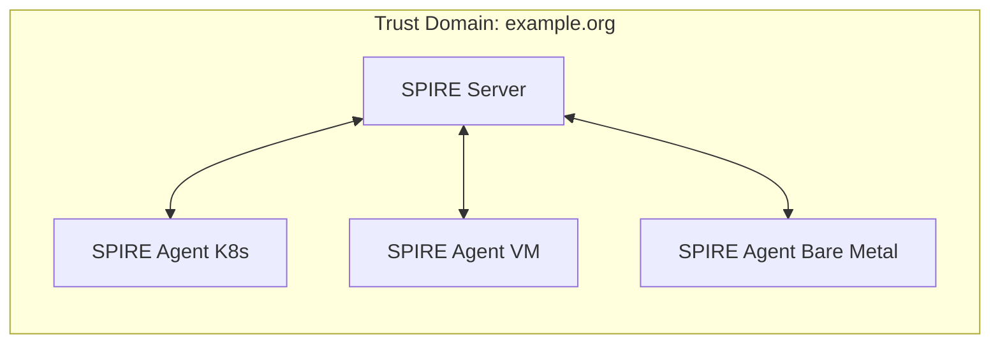
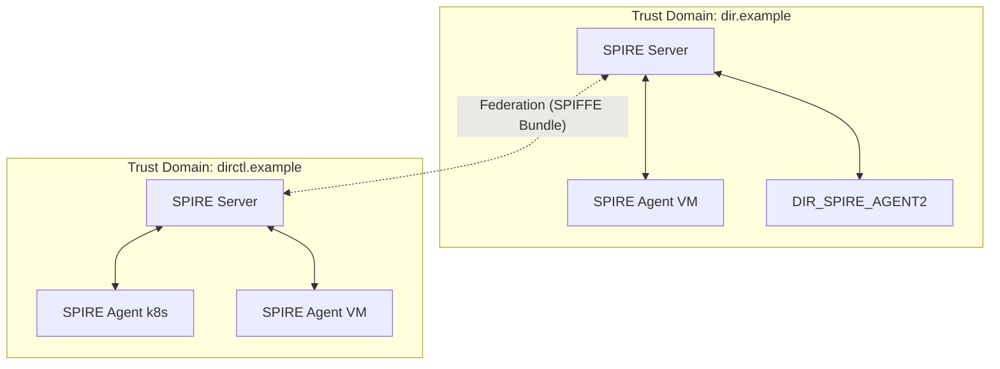
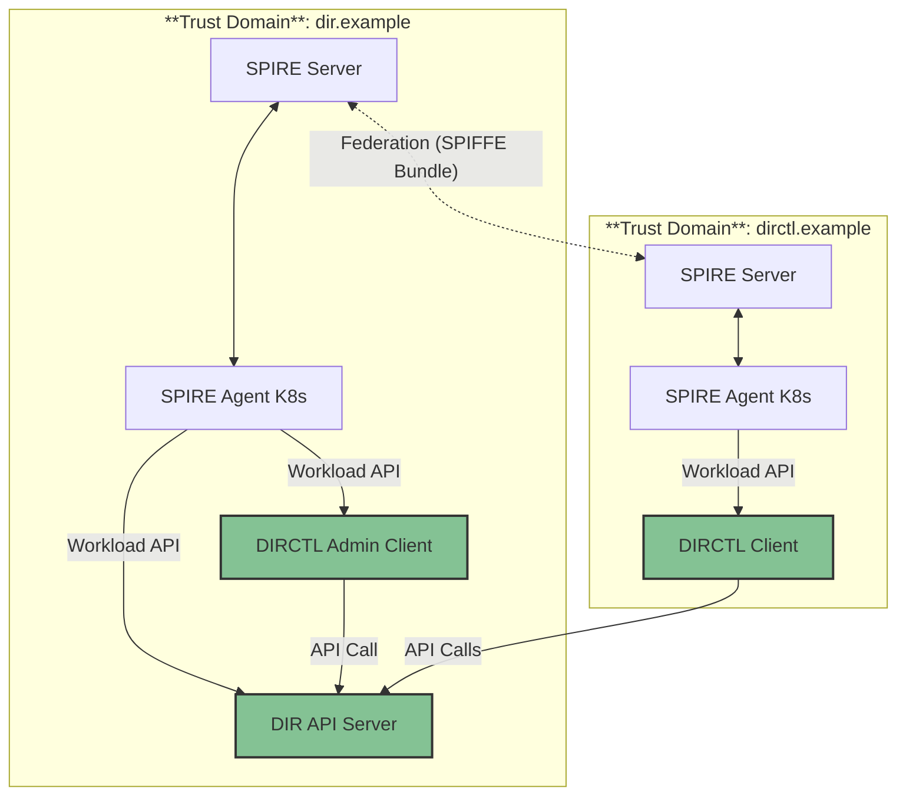

# Security Trust Model

## Overview

Directory is a system designed to provide secure, authenticated, and authorized access to
services and resources across multiple environments and organizations. Its trust model has
two complementary layers:

- **Record signing and verification** — cryptographic provenance and integrity for
  individual records (see [Record Signing and Verification](#record-signing-and-verification)).
- **Security scanning** — automated behavioral and static analysis of record source code and
  skill bundles (see [Security Scanning](#security-scanning)).
- **Workload identity** — authenticated, authorized communication between components,
  built on [SPIRE](https://spiffe.io/) and zero-trust principles (covered in the rest of
  this page).

The workload identity layer leverages [SPIRE](https://spiffe.io/) to manage workload
identities and enable zero-trust security principles.

[SPIRE](https://spiffe.io/docs/latest/spire-about/) (SPIFFE Runtime Environment) is an open-source system that provides automated,
cryptographically secure identities to workloads in modern infrastructure. It implements the
[SPIFFE](https://spiffe.io/) (Secure Production Identity Framework For Everyone) standard, enabling zero-trust
security by assigning each workload a unique, verifiable identity (SVID).

In the Directory project, SPIRE is used to:

- Securely identify and authenticate workloads (services, applications, etc.).
- Enable mutual transport layer security (mTLS) between services.
- Support dynamic, scalable, and multi-environment deployments.
- Enable interconnectivity between different organizations.
- Provide primitives for authorization logic.

## Record Signing and Verification

Establishing trust and authenticity is critical in distributed AI agent ecosystems, where
records may be shared across multiple nodes and networks. By cryptographically signing
records, publishers can prove authorship and ensure data integrity, while consumers can
verify that records haven't been tampered with and originate from trusted sources before
deploying or executing agent code.

### How signing works

Signatures and public keys are stored in the OCI registry as referrer artifacts that
maintain subject relationships with their associated records. When a record is signed, the
signature is attached as a Cosign-compatible OCI artifact. Public keys are similarly stored
as separate OCI artifacts, creating a verifiable chain of trust through OCI's native
referrer mechanism.

Server-side verification leverages Zot's trust extension through GraphQL queries that check
both signature validity and trust status. When public keys are uploaded to Zot, they enable
the registry to mark signatures as "trusted" when they can be cryptographically verified
against the stored public keys. The verification process queries Zot's search API to
retrieve signature metadata including the `IsSigned` and `IsTrusted` status, allowing the
Directory server to make trust decisions based on the cryptographic verification performed
by the underlying OCI registry infrastructure.

### Signing methods

Directory supports several signing flows depending on the environment:

- **OIDC-based interactive** — identity-based signing through a browser-based OIDC flow,
  implemented with [Sigstore](https://www.sigstore.dev/). Best for local, interactive use.
- **OIDC-based non-interactive** — uses OIDC tokens provided by the execution environment
  (such as GitHub Actions) to sign records in automated pipelines without user interaction.
- **Self-managed keys** — uses a signing keypair (for example, generated with Cosign) where
  the private key signs the record. Suitable for CI/CD where browser-based authentication is
  not possible or desired.

For CLI walkthroughs of each method, see
[Usage Guide — Signing and Verification](dir-features-scenarios.md#signing-and-verification).

### Name verification

Name verification proves that the signing key is authorized by the domain claimed in the
record's `name` field. This provides cryptographic proof of domain ownership and enables
human-readable references while maintaining security.

A record qualifies for name verification when:

- The record name includes a protocol prefix: `https://domain/path` or `http://domain/path`.
- A [JWKS (JSON Web Key Set)](https://datatracker.ietf.org/doc/html/rfc7517) file is hosted
  at `<scheme>://<domain>/.well-known/jwks.json`.
- The record is signed with the private key corresponding to a public key present in that
  JWKS file.

Once a name is verified, records can be referenced using Docker-style name references
(`name`, `name:version`, `name:version@cid`) instead of raw CIDs. See
[Records](dir-component-records-validation.md) for the verifiable name model.

## Security Scanning

Security scanning provides automated behavioral and static analysis of records to detect
vulnerabilities, policy violations, and malicious patterns before records are consumed.

### How scanning works

The Directory reconciler runs two scanner types against each record:

- **[MCP scanner](https://cisco-ai-defense.github.io/docs/mcp-scanner)** (`mcp-scanner behavioral`) — clones the source repository referenced in the
  record's `source_code` locator and runs behavioral analysis. Invoked automatically for
  records that have a source-code locator.
- **[Skill scanner](https://cisco-ai-defense.github.io/docs/skill-scanner)** (`skill-scanner scan --use-behavioral --use-trigger`) — extracts the
  agentskills bundle from the record's `integration/mcp` module artifact and runs static,
  bytecode, pipeline, behavioral, and trigger analyzers. Invoked automatically for records
  that include a skill bundle.

Scan results are persisted in two places:

1. **OCI referrer** — the full `ScanReport` (findings, severity, analyzer list, timestamp) is
   stored as an OCI referrer artifact attached to the record in the registry.
2. **Search index** — a summary row (`is_safe`, `max_severity`, scanner type) is written to
   the local database so `--safe` and `--scan-severity` search filters work without
   fetching referrers.

Records are re-scanned when the previous result is older than the configured TTL (default
7 days). The scanner runs only when the scanner binary is available on PATH (or at the
configured CLI path); it is skipped otherwise.

### Trust semantics

| State | Meaning |
|-------|---------|
| No scan report | Record has not been scanned yet (scanner was skipped or hasn't run) |
| `is_safe=true` | Scanner ran and found no security issues |
| `is_safe=false` | Scanner ran and flagged at least one issue |

A record is considered **safe** (matched by `--safe`) only when:

- At least one scanner ran (was not skipped)
- No scanner reported `is_safe=false`

Records where all applicable scanners were skipped (no source repo, no skill bundle) are not
considered safe and will not appear in `--safe` search results.

### Scanner installation

Scanners are installed via `uv`:

```bash
task deps:scanners
```

This installs `mcp-scanner` and `skill-scanner` to `~/.local/bin/` (added to PATH automatically by `uv`). For CI environments, the task is also available as `task deps:mcp-scanner` and `task deps:skill-scanner` separately.

### Accessing scan results

```bash
# Pull scan reports for a record
dirctl pull <cid> --scan-report

# Search for records all scanners reported as safe
dirctl search --safe

# Search by maximum finding severity
dirctl search --scan-severity HIGH
```

For full CLI usage, see [Security Scanning — Features Guide](dir-features-scenarios.md#security-scanning) and [CLI Reference — Security Scanning](dir-cli-reference.md#security-scanning).

## Authentication and Authorization

### Authentication

SPIRE provides strong, cryptographically verifiable identities (SPIFFE IDs) to every
workload. These identities are used for:

- **Workload Authentication:** Every service, whether running in Kubernetes, on a VM, or on bare metal, receives a unique SPIFFE ID (e.g., `spiffe://dir.example/ns/default/sa/my-service`).
- **Cross-Organization Authentication:** Through federation, workloads from different organizations or clusters can mutually authenticate using their SPIFFE IDs, without the need to implement custom cross-org authentication logic.
- **Mutual TLS (mTLS):** SPIRE issues SVIDs (X.509 certificates) that are used to establish mTLS connections, ensuring both parties are authenticated and communication is encrypted.

**What problem does SPIRE solve?**

- Eliminates the need to build and maintain custom authentication systems for each environment or organization.
- Provides a standard, interoperable identity for every workload, regardless of where it runs.
- Enables secure, automated trust establishment between independent organizations or clusters.

#### How Directory uses SPIRE for Authentication

- **Workload Identity:** Each Directory component (API server, clients, etc.) is assigned a SPIFFE ID based on its SPIRE Agent configuration.
- **Cross-Organization Authentication:** Directory can authenticate workloads from other organizations or clusters using their SPIFFE IDs, enabling secure communication without custom integration.
- **Secure Communication:** Directory can establish mTLS connections between components using the SVIDs issued by SPIRE, ensuring secure and authenticated communication.

### Authorization

SPIRE itself does not enforce authorization, but it enables fine-grained authorization by providing strong workload identities:

- **Policy-Based Access Control:** Applications and infrastructure can use SPIFFE IDs to define and enforce access policies (e.g., only workloads with a specific SPIFFE ID can access a sensitive API).
- **Attribute-Based Authorization:** SPIFFE IDs can encode attributes (namespace, service account, environment) that can be used in authorization decisions.
- **Cross-Domain Authorization:** Because SPIRE federates trust domains, authorization policies can include or exclude identities from other organizations or clusters, enabling secure collaboration without manual certificate management.

**What problem does SPIRE solve?**

- Enables authorization decisions based on workload identity, not just network location or static credentials.
- Simplifies policy management by using a standard identity format (SPIFFE ID) across all environments.
- Makes it possible to securely authorize workloads from federated domains (e.g., partner organizations, multi-cloud, hybrid setups) without custom integration.

#### How Directory uses SPIRE for Authorization

- **Policy Enforcement:** Directory components can enforce access control policies based on the SPIFFE IDs of incoming requests, ensuring that only authorized workloads can access specific services or APIs.
- **Access Control:** Directory can leverage attributes encoded in SPIFFE IDs to implement fine-grained access control policies.
- **Federated Authorization:** Directory can use SPIFFE IDs to authorize workloads from other organizations or clusters, enabling secure collaboration without custom integration.

Currently, Directory implements static authorization policies based on SPIFFE IDs, with plans to enhance this with dynamic, attribute-based policies in future releases. The Authorization policies are enforced based on external trust domains in the following manner:

| API Method                        | Authorized Trust Domains                    |
| --------------------------------- | ------------------------------------------- |
| `*`                               | Your own trust domain (e.g., `dir.example`) |
| `Store.Pull`                      | External Trust domain                       |
| `Store.Lookup`                    | External Trust domain                       |
| `Store.PullReferrer`              | External Trust domain                       |
| `Sync.RequestRegistryCredentials` | External Trust domain                       |

## Topology

The Directory's security trust schema supports both single and federated trust domain topology setup, with SPIRE deployed across various environments:

### Single Trust Domain

- **SPIRE Server**: Central authority for the trust domain.

- **SPIRE Agents**: Deployed in different environments, connect to the SPIRE Server:

    - Kubernetes clusters (as DaemonSets or sidecars)
    - VMs (as systemd services or processes)
    - Bare metal

- **Workloads**: Obtain identities from local SPIRE Agent via the Workload API.



### Federated Trust Domains

- Each environment (e.g., cluster, organization) runs its own SPIRE Server and Agents
- SPIRE Servers exchange bundles to establish federation
- Enables secure, authenticated communication between workloads in different domains

For step-by-step federation setup with the public Directory network, see [Running a Federated Directory Instance](dir-federation-setup.md). For technical details on federation profiles (https_web vs https_spiffe), see [Federation Profiles](dir-federation-profiles.md).



## Deployment

In order to deploy Directory with Security Trust Model support, it is required
to deploy SPIRE components.

### SPIRE Server

The SPIRE Server is configured as follows:

- **Deployment Options**: Can be deployed either as a Kubernetes or
as a standalone service, providing flexibility for different infrastructure setups.

- **Trust Domain Configuration**: Requires a unique trust domain name
(such as dir.example) to establish its identity scope.

- **Federation Support**: Federation is enabled to allow cross-domain
trust relationships between different SPIRE deployments.
If the federation is not required, it can be left disabled.
See [Running a Federated Directory Instance](dir-federation-setup.md) for configuration.

- **Bundle Endpoint**: Exposes a bundle endpoint that enables federation
by allowing other SPIRE servers to exchange trust bundles.
See [Federation Profiles](dir-federation-profiles.md) for profile options (https_web, https_spiffe).

```bash
# Set the trust domain
export TRUST_DOMAIN="my-service.local"

# Add the SPIFFE Helm chart repository
helm repo add spiffe https://spiffe.github.io/helm-charts-hardened

# Install SPIRE CRDs
helm upgrade spire-crds spire-crds \
    --repo https://spiffe.github.io/helm-charts-hardened/ \
    --create-namespace -n spire-crds \
    --install \
    --wait \
    --wait-for-jobs \
    --timeout "15m"

# Install SPIRE Server with federation enabled
helm upgrade spire spire \
    --repo https://spiffe.github.io/helm-charts-hardened/ \
    --set global.spire.trustDomain="$TRUST_DOMAIN" \
    --set spire-server.federation.enabled="true" \
    --set spire-server.controllerManager.watchClassless="true" \
    --namespace spire \
    --create-namespace \
    --install \
    --wait \
    --wait-for-jobs \
    --timeout "15m"
```

### SPIRE Agent

The SPIRE Agent serves as the local identity provider for workloads and has the following characteristics:

- **Deployment Methods**: SPIRE Agents can be deployed in multiple ways depending on the infrastructure -
as DaemonSets in Kubernetes environments or as standalone services on VMs and bare metal servers.
SPIRE Helm chart deploys a K8s SPIRE Agent across all nodes by default.
- **Server Communication**: Agents establish connections to the SPIRE Server to obtain workload identities,
acting as intermediaries between workloads and the central identity authority.
- **Workload Services**: Agents perform workload attestation (verification of workload identity) and
distribute SVIDs (SPIFFE Verifiable Identity Documents) through the Workload API, enabling secure
identity management at the workload level.

### Directory Services

Directory components can be deployed in the trust domain and configured
to use SPIRE with or without federation:

```yaml
# Example Directory Server configuration to use SPIRE.
# Add client to server trust domain.
dir:
  apiserver:
    spire:
      enabled: true
      trustDomain: ${SERVER_TRUST_DOMAIN}
      federation:
        - trustDomain: ${CLIENT_TRUST_DOMAIN}
          bundleEndpointURL: https://${CLIENT_BUNDLE_ADDRESS}
          bundleEndpointProfile:
            type: https_spiffe
            endpointSPIFFEID: spiffe://${CLIENT_TRUST_DOMAIN}/spire/server
          trustDomainBundle: |
            ${CLIENT_BUNDLE_CONTENT}

# Example Directory Client configuration to use SPIRE.
dirctl:
  spire:
    enabled: true
    trustDomain: ${CLIENT_TRUST_DOMAIN}
```

## Test Example

This test setup relies on using [Kubernetes Kind](https://kind.sigs.k8s.io/) clusters
running in [Docker](https://www.docker.com/) to simulate Security Trust Model in
federated setups. In the following example, we will:

- Setup Two Kubernetes Kind clusters (one for each trust domain)
- Deploy SPIRE Servers and Agents in each cluster
- Configure Federation to establish trust between the clusters
- Deploy Directory services to communicate securely using SPIFFE identities



**Deployment Tasks**

The test example uses [kubernetes-sigs/cloud-provider-kind](https://github.com/kubernetes-sigs/cloud-provider-kind)
to expose Kubernetes Directory and SPIRE as *LoadBalancer* services between clusters.

```bash
## Fetch Directory source
git clone https://github.com/agntcy/dir
cd dir

## Build all components
task build

## Deploy full federation setup
task test:spire

## Cleanup test environment
task test:spire:cleanup
```

For more details, see:

- [Running a Federated Directory Instance](dir-federation-setup.md) - Connect to the public Directory network
- [Federation Profiles](dir-federation-profiles.md) - https_web vs https_spiffe configuration
- [SPIRE Documentation](https://spiffe.io/docs/latest/spiffe-about/overview/)
- [SPIRE Federation Guide](https://spiffe.io/docs/latest/spire-helm-charts-hardened-advanced/federation/)
