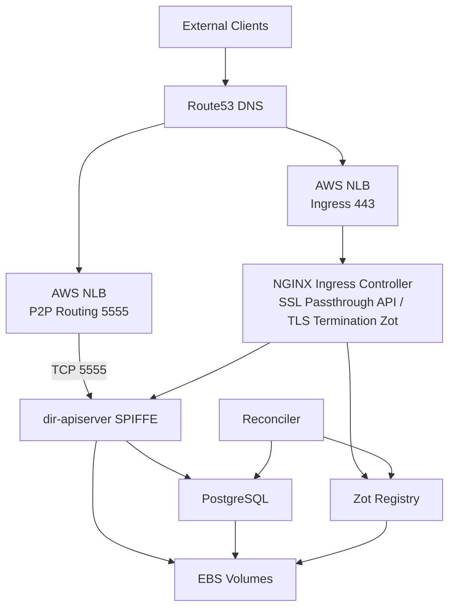

# Production Deployment

This guide documents production deployment of Directory on AWS EKS. For a single opinionated AWS walkthrough that carries the deployment all the way into public federation, see [Federation on Amazon EKS](dir-federation-aws-eks.md). For local development and testing, see [Quickstart](dir-quickstart.md) and [Local Deployment](dir-deployment-local.md). For connecting to the public Directory network or federating your instance, see [Federation](dir-federation-overview.md) and [Running a Federated Directory Instance](dir-federation-setup.md).

!!! important "Trust Domain Selection"
    Choose your **trust domain** carefully before deployment—it cannot be changed later. A trust domain is a permanent identifier for your SPIRE deployment (e.g., `acme.com`, `engineering.acme.com`).

    **Requirements:**
    - Must be globally unique
    - Cannot be changed after deployment
    - Does not need to be a real DNS domain (but can be)
    - Will be visible to federation partners

## Overview

Production deployment uses:

- **Platform:** AWS EKS (Elastic Kubernetes Service)
- **Ingress:** NGINX Ingress Controller with SSL passthrough
- **Identity:** SPIFFE/SPIRE for zero-trust authentication
- **Storage:** Zot OCI Registry with persistent volumes
- **GitOps:** ArgoCD for deployment management

## Architecture



## Prerequisites

### Infrastructure

- **AWS EKS Cluster** – Kubernetes 1.31+
- **NGINX Ingress Controller** with `--enable-ssl-passthrough=true`
- **SPIRE** – SPIFFE Runtime Environment
- **ExternalDNS** – Automatic DNS management (Route53)
- **cert-manager** – TLS certificate management
- **External Secrets Operator** – Vault integration
- **ArgoCD** – GitOps deployment

### Network

- **Route53 Hosted Zone** – For your domains (e.g., `*.your-domain.com`)
- **AWS Network Load Balancer** – Layer 3/4 TCP passthrough for both ingress (443) and P2P routing (5555)
- **Security Groups** – Allow inbound TCP 443 (HTTPS) and TCP 5555 (P2P routing) from the internet on the load balancers; allow egress to Let's Encrypt, Route53, and federation endpoints

### Storage

- **EBS CSI Driver** – For persistent volumes
- **Storage Class** – `ebs-sc-encrypted` for production
- **Vault** – For credential storage

## Local vs Production

| Feature | Local (Kind) | Production (EKS) |
|---------|--------------|------------------|
| **Cluster** | Kind | AWS EKS |
| **SPIFFE CSI Driver** | ✅ Enabled | ✅ Enabled |
| **Storage** | emptyDir (ephemeral) | PVCs (persistent) |
| **Credentials** | Hardcoded in values | ExternalSecrets + Vault |
| **Resources** | 250m/512Mi | 500m–2000m / 1–4Gi |
| **Ingress** | NodePort, port-forward | Ingress + TLS |
| **Rate Limits** | 50 RPS | 500+ RPS |
| **Trust Domain** | example.org (local only) | your-domain.com |

## Key Production Features

### SPIFFE CSI Driver

Enabled via `spire.useCSIDriver: true` (v1.0.0-rc.4+):

- Synchronous workload identity injection before pod start
- Eliminates "certificate contains no URI SAN" errors
- Required for CronJobs and short-lived workloads

### Persistent Storage

- Enable PVCs for routing datastore and database
- Use `strategy.type: Recreate` to prevent database lock conflicts
- Production example: 20Gi routing, 5Gi database, 100Gi Zot

### Zot Storage Backend

The bundled Zot registry is configured through `apiserver.zot.configFiles."config.json"`
in the chart values. The shipped default uses local filesystem storage
(`storage.rootDirectory`) backed by a PVC, and leaves Zot's own defaults in place —
including `dedupe`, which Zot defaults to `true`.

Two storage layouts are supported for a production node:

| Layout | `storage` settings | Notes |
|--------|-------------------|-------|
| **Local filesystem (default)** | `rootDirectory` only | Backed by a PVC. Dedupe and GC work with Zot's built-in local cache. Single writer. |
| **Remote object storage (S3)** | `storageDriver` + either `dedupe: false` **or** a `cacheDriver` | Zot cannot dedupe on remote storage using its local cache. |

!!! note "S3 storage requires an explicit dedupe decision"
    Zot does not start when `storage.storageDriver` points at remote object
    storage and `dedupe` is left at its default of `true` with no remote cache
    configured. Startup fails config validation with:

    ```text
    invalid database config, dedupe set to true with remote storage and database,
    but no remote database configured
    ```

    Because the shipped `config.json` does not set `dedupe`, adding an S3
    `storageDriver` to it without also setting `dedupe` produces this failure.

Pick one of the following when moving Zot to S3:

=== "Option A — disable dedupe (no extra AWS resources)"

    ```json
    "storage": {
      "rootDirectory": "/var/lib/registry",
      "dedupe": false,
      "storageDriver": {
        "name": "s3",
        "region": "us-east-1",
        "bucket": "your-dir-bucket",
        "rootdirectory": "/zot"
      }
    }
    ```

=== "Option B — keep dedupe, add a DynamoDB cache"

    ```json
    "storage": {
      "rootDirectory": "/var/lib/registry",
      "dedupe": true,
      "storageDriver": {
        "name": "s3",
        "region": "us-east-1",
        "bucket": "your-dir-bucket",
        "rootdirectory": "/zot"
      },
      "cacheDriver": {
        "name": "dynamodb",
        "region": "us-east-1",
        "cacheTablename": "ZotBlobTable",
        "repoMetaTablename": "ZotRepoMetadataTable",
        "imageMetaTablename": "ZotImageMetaTable",
        "repoBlobsInfoTablename": "ZotRepoBlobsInfoTable",
        "userDataTablename": "ZotUserDataTable",
        "apiKeyTablename": "ZotApiKeyTable",
        "versionTablename": "ZotVersion"
      }
    }
    ```

Neither snippet sets S3 credentials. Zot resolves them the same way the AWS SDK
does — in a cluster, prefer an IAM role (IRSA on EKS) attached to the Zot service
account and set nothing in the config. To supply them explicitly instead, add
`accesskey` and `secretkey` to the `storageDriver` block. For S3-compatible
storage such as MinIO, also set `regionendpoint` (and `"secure": false` for a
plaintext endpoint).

Notes for either option:

- Keys inside `storageDriver` are passed through to the underlying storage driver
  and are **not** validated by Zot. A misspelled key — `accessKeyId` instead of
  `accesskey`, for example — is silently ignored: `zot verify` still reports the
  config as valid, and the problem only surfaces once Zot contacts S3 at startup.
  Match the parameter names in the Zot storage documentation exactly.
- Keep `storage.rootDirectory` set even when `storageDriver` is present. Zot
  exits at startup with `no storage config provided` if it is missing, and
  `zot verify` does not catch that — the config passes validation and the
  pod then crash-loops. The key prefix used inside the bucket comes from
  `storageDriver.rootdirectory`, not from `storage.rootDirectory`.
- Only `dedupe` is gated by config validation. Garbage collection (`gc`) and the
  `search` extension do not block startup on S3 — a config with `dedupe: false`,
  GC at its default, and search enabled passes `zot verify` and boots against
  remote storage. That is a startup result, not a statement about how GC behaves
  on remote storage over time: GC runs on an interval (`storage.gcInterval` and
  `storage.gcDelay`, both one hour by default), so a clean boot does not exercise
  it. If you see GC-related errors in the Zot logs after the first interval, set
  `"gc": false` and open an issue.
- Without a `cacheDriver`, Zot keeps its metadata database on local disk, so a
  remote-storage deployment is still effectively **single-replica**. Use Option B
  if you need to scale Zot horizontally.
- Validate any config change before rolling it out. This catches the dedupe
  error above, but not every startup failure (see the `rootDirectory` note).
  Use the Zot version the chart actually deploys — the zot subchart pinned in
  `install/charts/dir/apiserver/Chart.lock`, whose image tag is also tracked as
  `ZOT_VERSION` in `Taskfile.vars.yml`:

  ```bash
  docker run --rm -v "$PWD:/cfg:ro" \
    ghcr.io/project-zot/zot-linux-amd64:v2.1.18 verify /cfg/config.json
  ```

See the [Zot storage documentation](https://zotregistry.dev/latest/admin-guide/admin-configuration/#storage)
for the full set of storage and cache options.

### Secure Credential Management

- Use External Secrets Operator with Vault
- See [External Secrets Operator documentation](https://external-secrets.io/latest/)

### SSL Passthrough for DIR API

The Directory API uses SPIFFE mTLS. Ingress must:

1. **Not** terminate TLS
2. Pass encrypted traffic to the backend
3. Route based on SNI

**Ingress configuration:**

```yaml
annotations:
  nginx.ingress.kubernetes.io/ssl-passthrough: "true"
  nginx.ingress.kubernetes.io/backend-protocol: "GRPCS"

tls:
  - hosts:
      - api.your-domain.com
    # NO secretName - required for SSL passthrough!
```

**NGINX Ingress Controller** must have `--enable-ssl-passthrough=true`.

## DNS Hostnames

Create DNS records for your domain. Example with `your-domain.com`:

| Service | Hostname | Port |
|---------|----------|------|
| **Directory API** | api.your-domain.com | 443 (SSL passthrough) |
| **Zot Registry** | zot.your-domain.com | 443 (TLS termination) |
| **P2P Routing** | routing.your-domain.com | 5555 (TCP via NLB) |
| **SPIRE Federation** | spire.your-domain.com | 443 (TLS termination) |
| **SPIRE OIDC** | oidc-discovery.spire.your-domain.com | 443 (TLS termination) |

If you also want authenticated access for external users, `dirctl`, or automation, pair the production deployment with the optional OIDC gateway pattern described in [OIDC Authentication for Directory](dir-component-oidc-authentication.md). This is separate from SPIRE OIDC discovery used for federation.

## Verification

### SSL Passthrough

```bash
# Should show SPIFFE certificate, not "ingress.local"
echo | openssl s_client -connect api.your-domain.com:443 \
  -servername api.your-domain.com 2>/dev/null | \
  openssl x509 -noout -subject

# Expected: C=US, O=SPIRE, CN=api.your-domain.com (or your trust domain)
```

### SPIFFE Authentication

```bash
kubectl logs -n <your-dir-namespace> -l app.kubernetes.io/name=apiserver | \
  grep "Successfully obtained valid X509-SVID"
```

### P2P Routing Service

```bash
# Verify the NLB and DNS record exist
dig +short routing.your-domain.com

# Verify TCP connectivity on port 5555
nc -zv routing.your-domain.com 5555

# Check the apiserver logs for the published multiaddr
kubectl logs -n <your-dir-namespace> -l app.kubernetes.io/name=apiserver | \
  grep "multiaddr"
```

If the routing service is unreachable, peer discovery and publication will fail silently while the rest of the deployment appears healthy.

### CronJobs

```bash
kubectl get pods -n <your-dir-admin-namespace> --sort-by=.metadata.creationTimestamp | tail -10
```

## Troubleshooting

### "certificate contains no URI SAN"

- Verify SSL passthrough is working (certificate test above)
- Ensure `useCSIDriver: true` in values
- Check SPIRE entry has synced

### "certificate is valid for ingress.local"

- DNS may point to wrong LoadBalancer
- Ensure Ingress TLS section has `hosts` but **no** `secretName`
- Verify NGINX has `--enable-ssl-passthrough=true`

### Peer Discovery or Publication Fails Silently

- Verify `routing.your-domain.com` resolves and TCP 5555 is reachable from outside the cluster
- Check that the security group for the routing NLB allows inbound TCP 5555
- Confirm ExternalDNS created the routing DNS record: `kubectl get svc -n <your-dir-namespace>` should show an `EXTERNAL-IP` for the routing `LoadBalancer` service
- Check apiserver logs for multiaddr registration errors

### Zot CrashLoopBackOff: "dedupe set to true with remote storage"

Full message:

```text
invalid database config, dedupe set to true with remote storage and database,
but no remote database configured
```

The Zot config points at remote object storage but leaves `dedupe` at its
default of `true` without a remote `cacheDriver`. Set `dedupe: false` or add a
`cacheDriver`. See [Zot Storage Backend](#zot-storage-backend).

### Zot CrashLoopBackOff: "no storage config provided"

`storage.rootDirectory` is missing. It is required even when
`storage.storageDriver` is set. Note that `zot verify` reports this config as
valid, so the failure only shows up in the pod logs.

### ConfigMap Changes Not Taking Effect

ConfigMaps are mounted at pod creation. Restart the deployment:

```bash
kubectl rollout restart deployment/<your-apiserver-deployment> -n <your-dir-namespace>
```

## Reference

- [dir-staging](https://github.com/agntcy/dir-staging) – Example deployment with ArgoCD and SPIRE (uses `ads.outshift.io` and related hosts for the public Directory)
- [OIDC Authentication for Directory](dir-component-oidc-authentication.md) – External OIDC auth model, IdP options, and edge authorization flow
- [Running a Federated Directory Instance](dir-federation-setup.md) – Federation setup for connecting to the public network
- [Federation Profiles](dir-federation-profiles.md) – Profile comparison and configuration
