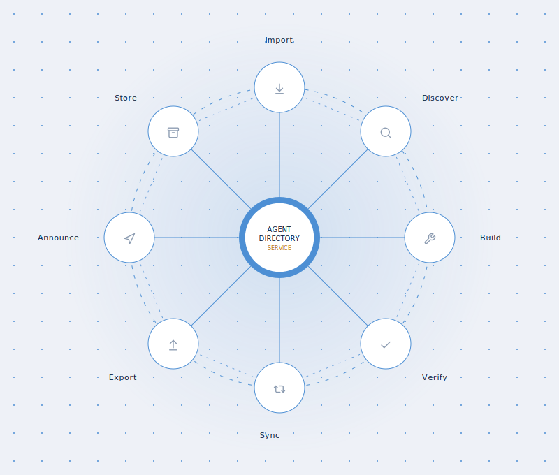
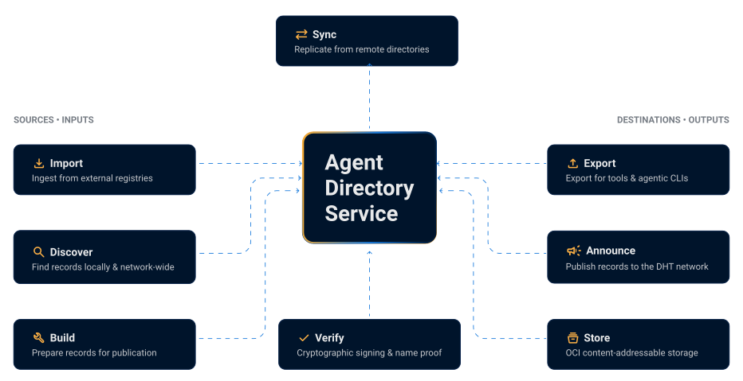

---
hide:

  - navigation
  - toc

---

Publish and discover agent records in a few commands. Install the real CLI from the [Quickstart](dir/dir-quickstart.md).
{: .dirctl-terminal-intro data-intro-level="cli" hidden}

Use `dirctl --help` to see available commands. See the [CLI Reference](dir/dir-cli-reference.md) for more details.
{: .dirctl-terminal-intro data-intro-level="try" hidden}

Need a skill, MCP server, or A2A partner? Your agent searches the Directory, wires it in, and uses it right away. See the [MCP server](dir/dir-component-mcp-server.md) for more details.
{: .dirctl-terminal-intro data-intro-level="agent"}

<section class="dir-hero">
  

    <h1 class="dir-hero__title">Agent Directory Service</h1>
    

      part of
      <a
        href="https://www.linuxfoundation.org/press/linux-foundation-welcomes-the-agntcy-project-to-standardize-open-multi-agent-system-infrastructure-and-break-down-ai-agent-silos"
        target="_blank"
        rel="noopener noreferrer"
      >
        <picture>
          <source
            media="(max-width: 59.9375em)"
            srcset="assets/lf-stacked-white.png"
          />
          
        </picture>
      </a>
    

    

      One federated registry for  cross-framework agent discovery.
    

    

      An open-source, framework-agnostic registry for managing the full agent lifecycle.
      ADS provides a federated control plane to publish, verify, and discover agents across
      any vendor or platform, enabling seamless interoperability for complex, multi-agent workflows.
    

    

      <a class="dir-hero__btn" href="#quick-start">
        Quick start
        <svg viewBox="0 0 24 24" aria-hidden="true"><path d="M12 4l-1.41 1.41L16.17 11H4v2h12.17l-5.58 5.59L12 20l8-8z"/></svg>
      </a>
      <a class="dir-hero__btn" href="https://github.com/agntcy/dir" target="_blank" rel="noopener noreferrer">
        GitHub
        <svg viewBox="0 0 24 24" aria-hidden="true"><path d="M12 .5C5.73.5.5 5.73.5 12c0 5.08 3.29 9.39 7.86 10.91.58.11.79-.25.79-.56 0-.28-.01-1.02-.02-2-3.2.7-3.88-1.54-3.88-1.54-.53-1.34-1.29-1.7-1.29-1.7-1.05-.72.08-.71.08-.71 1.16.08 1.77 1.19 1.77 1.19 1.03 1.77 2.7 1.26 3.36.96.1-.75.4-1.26.73-1.55-2.55-.29-5.23-1.28-5.23-5.69 0-1.26.45-2.29 1.19-3.1-.12-.29-.52-1.46.11-3.05 0 0 .97-.31 3.18 1.18a11.1 11.1 0 0 1 5.8 0c2.2-1.49 3.17-1.18 3.17-1.18.63 1.59.23 2.76.11 3.05.74.81 1.19 1.84 1.19 3.1 0 4.42-2.69 5.39-5.25 5.68.41.36.78 1.06.78 2.14 0 1.55-.01 2.8-.01 3.18 0 .31.21.68.8.56A11.51 11.51 0 0 0 23.5 12C23.5 5.73 18.27.5 12 .5z"/></svg>
      </a>
    

  

</section>

  

    

      
    

    
Capability-Based Discovery

    

      Publish and find agents by structured skills and attributes using OASF taxonomies
      and content routing across a distributed network of directory servers.
    

  

  

    

      
    

    
Federated Architecture

    

      Interconnect directory instances through DHT-based content routing, enabling
      decentralized discovery without a single central registry.
    

  

  

    

      
    

    
Verifiable Claims

    

      Cryptographic integrity and provenance for directory records help users make
      informed decisions about agent selection and trust.
    

  

<section class="dir-howto">
  <h2 class="dir-section-title">Publish, verify, and discover</h2>
  

    
    
  

</section>

<section class="dir-quickstart">
<h2 class="dir-section-title" id="quick-start">Quick start</h2>

<section class="dirctl-terminal-section">
  

    

      

        

          agent@workspace:~
          

            &#8211;
            &#10005;
          

        

        <pre
          class="dirctl-terminal-output"
          id="dirctl-terminal-output"
          aria-live="polite"
          aria-label="Terminal output"
        ></pre>
        <form class="dirctl-terminal-input" hidden>
          <label
            class="dirctl-terminal-prompt"
            for="dirctl-terminal-command"
          >user@dir:~$</label>
          <input
            id="dirctl-terminal-command"
            class="dirctl-terminal-command"
            type="text"
            autocomplete="off"
            spellcheck="false"
            aria-label="Enter a dirctl command"
          />
        </form>
      

    

    

      

        <button type="button" class="dirctl-terminal-btn is-active" data-demo-level="agent">With your agent</button>
        <button type="button" class="dirctl-terminal-btn" data-demo-level="cli">CLI basics</button>
        <button type="button" class="dirctl-terminal-btn" data-mode-switch="try">Try it yourself</button>
        <button type="button" class="dirctl-terminal-btn dirctl-terminal-reopen" hidden>Reopen terminal</button>
      

    

  

</section>
</section>

## Get started with ADS

- :material-rocket-launch:{ .lg .middle } **Quickstart**

    Run a local Directory instance in minutes.

    [:octicons-arrow-right-24: Quickstart](dir/dir-quickstart.md)

- :material-book-open:{ .lg .middle } **Read the Introduction**

    Understand core concepts, architecture, and features.

    [:octicons-arrow-right-24: Overview](dir/dir-overview.md)

    [:octicons-arrow-right-24: Architecture](dir/dir-architecture.md)

- :material-file-document-outline:{ .lg .middle } **Dive into the Specification**

    Explore the ADS Internet Draft and protocol definition.

    [:octicons-arrow-right-24: ADS Specification](https://datatracker.ietf.org/doc/draft-mp-agntcy-ads)

- :material-code-braces:{ .lg .middle } **SDKs and Tools**

    Client libraries, CLI, and API references.

    [:octicons-arrow-right-24: SDK Overview](dir/dir-sdk.md)

    [:octicons-arrow-right-24: CLI Reference](dir/dir-cli-reference.md)

- :material-cloud-upload:{ .lg .middle } **Deploy**

    Local, Kubernetes, and production deployment guides.

    [:octicons-arrow-right-24: Local Deployment](dir/dir-deployment-local.md)

    [:octicons-arrow-right-24: Production Deployment](dir/dir-prod-deployment.md)

- :material-newspaper-variant-outline:{ .lg .middle } **Linux Foundation Press Release**

    Read how the Linux Foundation welcomed the AGNTCY project to standardize open
    multi-agent system infrastructure and break down AI agent silos.

    [:octicons-arrow-right-24: LF press release](https://www.linuxfoundation.org/press/linux-foundation-welcomes-the-agntcy-project-to-standardize-open-multi-agent-system-infrastructure-and-break-down-ai-agent-silos)

- :material-lan-connect:{ .lg .middle } **Join the Federation Testbed**

    We invite organizations, researchers, and developers to join the Agent
    Directory Testbed—a decentralized, open staging environment for next-generation
    AI agent discovery and secure registry federation.

    [:octicons-arrow-right-24: Call for federation partners](https://github.com/agntcy/dir/discussions/455)

    [:octicons-arrow-right-24: Federated Directory setup](dir/dir-federation-setup.md)

