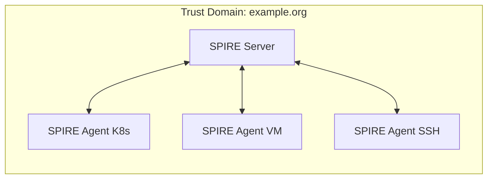
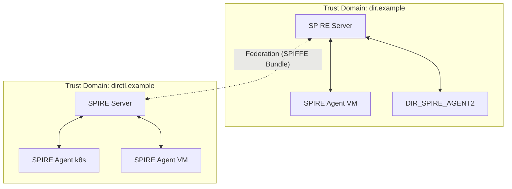
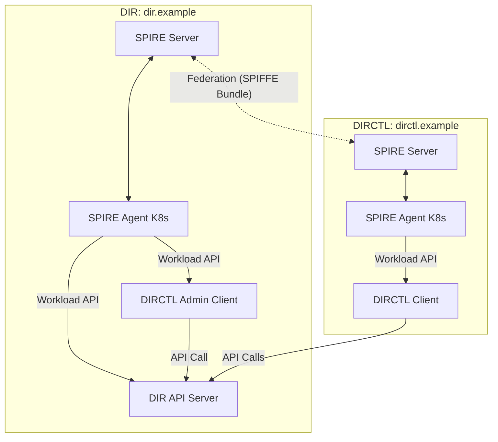

# Directory Security Trust Schema

## SPIRE Overview
SPIRE (SPIFFE Runtime Environment) is an open-source system that provides automated, cryptographically secure identities to workloads in modern infrastructure. It implements the SPIFFE (Secure Production Identity Framework For Everyone) standard, enabling zero-trust security by assigning each workload a unique, verifiable identity (SVID).
In the Directory project, SPIRE is used to:
- Securely identify and authenticate workloads (services, applications, etc.)
- Enable mutual TLS (mTLS) between services
- Support dynamic, scalable, and multi-environment deployments
- Enable interconnectivity between different organizations
- Provide primitives for authorization logic

## Authentication and Authorization

### Authentication
SPIRE provides strong, cryptographically verifiable identities (SPIFFE IDs) to every workload. These identities are used for:
- **Workload Authentication:** Every service, whether running in Kubernetes, on a VM, or on bare metal, receives a unique SPIFFE ID (e.g., `spiffe://dir.example/ns/default/sa/my-service`).
- **Cross-Organization Authentication:** Through federation, workloads from different organizations or clusters can mutually authenticate using their SPIFFE IDs, without the need to implement custom cross-org authentication logic.
- **Mutual TLS (mTLS):** SPIRE issues SVIDs (X.509 certificates) that are used to establish mTLS connections, ensuring both parties are authenticated and communication is encrypted.

**What problem does SPIRE solve?**
- Eliminates the need to build and maintain custom authentication systems for each environment or organization.
- Provides a standard, interoperable identity for every workload, regardless of where it runs.
- Enables secure, automated trust establishment between independent organizations or clusters.

### Authorization
SPIRE itself does not enforce authorization, but it enables fine-grained authorization by providing strong workload identities:
- **Policy-Based Access Control:** Applications and infrastructure can use SPIFFE IDs to define and enforce access policies (e.g., only workloads with a specific SPIFFE ID can access a sensitive API).
- **Attribute-Based Authorization:** SPIFFE IDs can encode attributes (namespace, service account, environment) that can be used in authorization decisions.
- **Cross-Domain Authorization:** Because SPIRE federates trust domains, authorization policies can include or exclude identities from other organizations or clusters, enabling secure collaboration without manual certificate management.

**What problem does SPIRE solve?**
- Enables authorization decisions based on workload identity, not just network location or static credentials.
- Simplifies policy management by using a standard identity format (SPIFFE ID) across all environments.
- Makes it possible to securely authorize workloads from federated domains (e.g., partner orgs, multi-cloud, hybrid setups) without custom integration.

## Architecture: Topology Setup
The Directory's security trust schema supports both single and federated trust domains, with SPIRE deployed across various environments:

### Single Trust Domain
- **SPIRE Server**: Central authority for the trust domain
- **SPIRE Agents**: Deployed in different environments, connect to the SPIRE Server
    - Kubernetes clusters (as DaemonSets or sidecars)
    -  VMs (as systemd services or processes)
    - Bare metal/SSH hosts
- **Workloads**: Obtain identities from local SPIRE Agent via the Workload API


### Federated Trust Domains
- Each environment (e.g., cluster, organization) runs its own SPIRE Server and agents
- SPIRE Servers exchange bundles to establish federation
- Enables secure, authenticated communication between workloads in different domains


## Deployment

### SPIRE Server Deployment
- Deployed as a Kubernetes service (or on VMs)
- Configured with a unique trust domain name (e.g., `dir.example`)
- Federation enabled to allow cross-domain trust
- Exposes a bundle endpoint for federation
```bash
export TRUST_DOMAIN="my-service.local"
export SERVICE_TYPE="LoadBalancer"
helm repo add spiffe https://spiffe.github.io/helm-charts-hardened
helm upgrade spire-crds spire-crds \
    --repo https://spiffe.github.io/helm-charts-hardened/ \
    --create-namespace -n spire-crds \
    --install \
    --wait \
    --wait-for-jobs \
    --timeout "15m"
helm upgrade spire spire \
    --repo https://spiffe.github.io/helm-charts-hardened/ \
    --set global.spire.trustDomain="$TRUST_DOMAIN" \
    --set spire-server.service.type="$SERVICE_TYPE" \
    --set spire-server.federation.enabled="true" \
    --set spire-server.controllerManager.watchClassless="true" \
    --namespace spire \
    --create-namespace \
    --install \
    --wait \
    --wait-for-jobs \
    --timeout "15m"
```

### SPIRE Agent Deployment
- Deployed as DaemonSets in Kubernetes, or as services on VMs/bare metal
- Connect to the SPIRE Server to obtain workload identities
- Attest workloads and provide SVIDs via the Workload API


### Directory SPIRE-enabled Deployment
```yaml
spire:
  enabled: true
  trustDomain: dir.example
  federation:
    - trustDomain: dirctl.example
      bundleEndpointURL: https://${DIRCTL_BUNDLE_ADDRESS}
      bundleEndpointProfile:
        type: https_spiffe
        endpointSPIFFEID: spiffe://dirctl.example/spire/server
      trustDomainBundle: |
        ${DIRCTL_BUNDLE_CONTENT}
```

### Example: End-to-End Deployment
- Two Kubernetes Kind clusters are created (one for each trust domain)
- SPIRE Servers and Agents are deployed in each cluster
- Federation is established between the clusters
- Directory services (DIR API Server, DIRCTL Client Internal, DIRCTL Client External) are deployed and communicate securely using SPIFFE identities



**Deployment Tasks:**
```bash
sudo task test:spire      # Deploys the full federation setup
task test:spire:cleanup   # Cleans up the test environment
```
---

For more details, see the [SPIRE Documentation](https://spiffe.io/docs/latest/spiffe-about/overview/) and [SPIRE Federation Guide](https://spiffe.io/docs/latest/spire-helm-charts-hardened-advanced/federation/).
