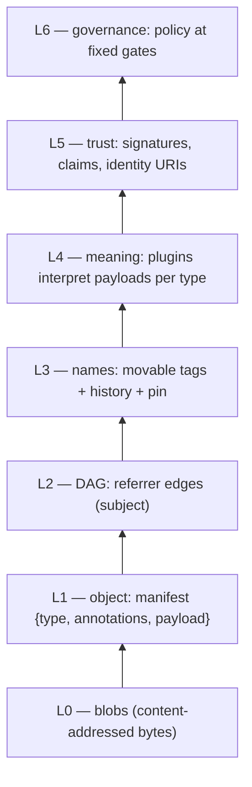
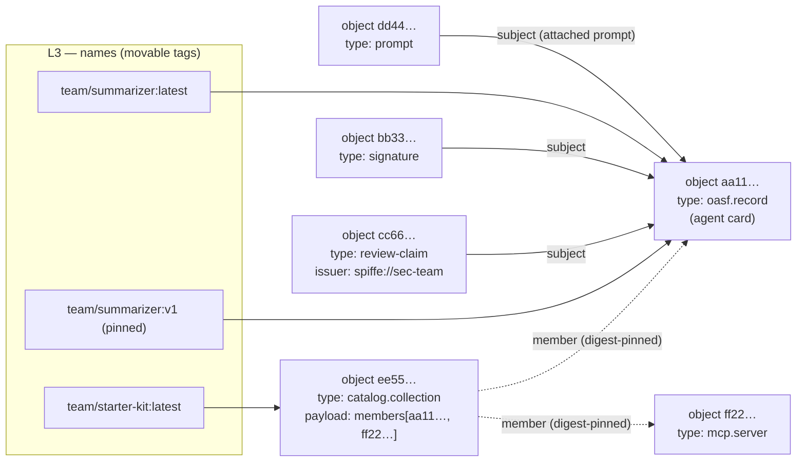
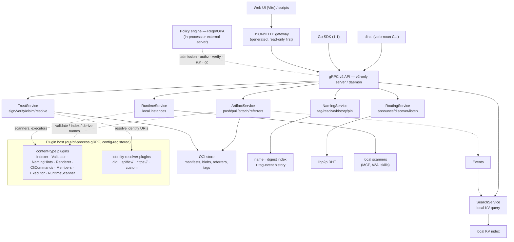
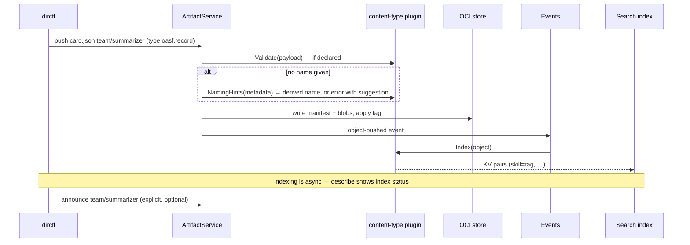
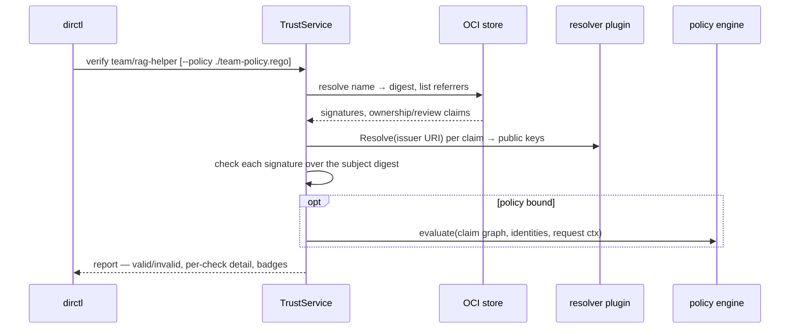
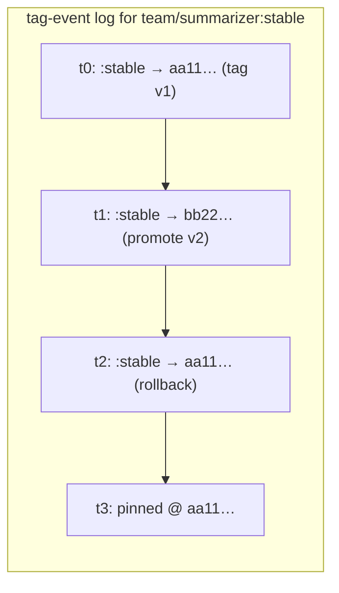
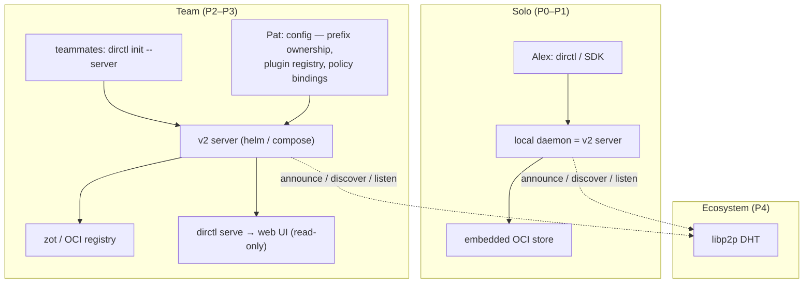

# Directory v2 — Concepts & Architecture (visual guide)

> Planning document. No implementation is part of this plan branch.

The mental model of Directory v2 on one page: every layer, every component, and how they
interact. Interfaces live in [01-architecture.md](./01-architecture.md), usage in
[02-cli-and-sdk-usage.md](./02-cli-and-sdk-usage.md), decisions in [00-overview.md](./00-overview.md).

## 1. The one-sentence model

> Directory is a **DAG of content-typed objects** stored on OCI, **named** by movable tags,
> **interpreted** by plugins, **searched** locally, **announced** globally, **trusted** through
> attached claims, and **governed** by policy.

## 2. Layers of the data model

Everything in the system is built by stacking six thin layers on top of content-addressed bytes:

| Layer | What it adds | Who owns it |
|---|---|---|
| L0 — Blobs | content-addressed bytes | OCI store |
| L1 — Object | one manifest: `{content type, annotations, payload layers}` → one digest | core (the **only** shape) |
| L2 — DAG | referrer edges: any object can point at any object as its *subject* | core (OCI Referrers API) |
| L3 — Names | movable tags → digests, with history and pinning | Naming |
| L4 — Meaning | what a payload *is* (agent card, prompt, member list, policy) | content-type plugins |
| L5 — Trust | signatures & claims over digests; identities as URIs | Trust + resolver plugins |
| L6 — Governance | Rego policy evaluated over all of the above at fixed gates | Policy engine |

## 3. The Object (there is only one shape)

The core data model defines exactly **one shape**: the **Object** — an OCI manifest whose
config carries `{content type, annotations}` and whose layers carry the payload. A digest
identifies it; tags name it; referrers decorate it.

**There is no dedicated Collection type.** A "collection" is a *pattern*: a content type whose
payload is a list of member refs, declared through the **Members capability** of its plugin
(01 §7). Member-wise command semantics (`install`, `sign`, `verify`, `announce` applying to all
members) attach to the capability, not to a special core type. `catalog.collection` is the
first-party type using the pattern; `dirctl create collection` is CLI sugar for pushing it —
any third-party type (e.g. `myorg.pipeline`) can declare Members and get identical behavior.

Two different edge kinds, both visible in `dirctl tree`:

- **Referrer edge** (solid): stored on the *pointing* object (`subject` field) — attach anything to anything, after the fact, without touching the target.
- **Member edge** (dotted): stored in the *collection-like* object's own payload — a frozen (digest-pinned) or following (name) list, interpreted via the Members capability.

### Can I tag anything? Yes.

Tags are pure name→digest mappings, independent of content type. Agents, prompts, policies,
collection-like objects — and even signatures and claims (they are ordinary objects) — can all
be tagged. Referrer objects are usually machine-managed and unnamed, but
`dirctl tag <ref> audits/q3-review` is perfectly legal. The only restriction is *authorization*:
prefix ownership decides who may tag under `team/*`.

## 4. Component architecture

Reading guide:

- **Six services, one thin optional `PolicyService`** — nothing else. Run/deploy, curation,
  and GC are compositions of these, not new services.
- **Plugins are the only place type-specific logic exists.** The server dispatches by content
  type (or identity URI scheme) to a plugin process; built-ins are first-party plugins on the
  same contract. Registration is operator-owned server config — the trust boundary.
- **Policy hooks are fixed** (admission, authz, verify, run gate, GC); policy sources are
  **external** — filesystem files bound via CLI/SDK or an external policy API (OPA bundles) —
  never objects in the store. Bindings are operator-owned server state.

## 5. Life of a push (write path)

## 6. Life of a verify (trust path)

Without a bound policy this is purely informational (badges ✓/⚠); binding a policy makes the
same evaluation enforcing — at verify, at admission, or as a run gate.

## 7. Naming layer (tags, history, pin)

- Names are any OCI path (`a`, `a/b`, `a/b/c`), tag optional → `:latest`.
- Tags **move**; every move is a recorded event (`get history`); `pin` freezes.
- Push takes the name positionally; no name ⇒ plugin-derived or error. **No anonymous objects,
  no digests in the UX** — digests live in output details, pins, and `dir://` URIs only.
- `dir://[host/]path[:tag][@digest]` is the fully-qualified serialization used in web links and
  refs embedded inside payloads; host is informational until federation lands.

## 8. Deployment shapes

The same binary and the same commands at every scale — the ladder adds endpoints, not concepts.

## 9. Concept FAQ

| Question | Answer |
|---|---|
| Can I tag anything? | Yes — tags are type-independent name→digest mappings; even signatures/claims can be tagged. Only prefix ownership restricts *where*. |
| Is there a Collection type? | No. One core shape (Object). "Collection" = the Members capability pattern on a content type; `catalog.collection` is the first-party example. |
| Do I ever type a digest? | No — hard guarantee. Names on push, `pin` for freezing, short digests in output only. |
| Where does type-specific behavior live? | Only in plugins (content-type handlers, identity resolvers), registered via operator config. |
| How do new CLI commands appear? | Plugins declare command manifests; `dirctl` merges them and dispatches custom commands via gRPC `Invoke` — register a plugin on the server and every user's CLI gains its commands (e.g. `dirctl reputation score <ref>`). |
| What blocks an action? | Only a bound policy. Defaults are informational (badges, warnings) and fail-open. |
| What deletes data? | Only a bound GC policy (`gc run`). Delete orphans referrers; GC sweeps by rule. |
