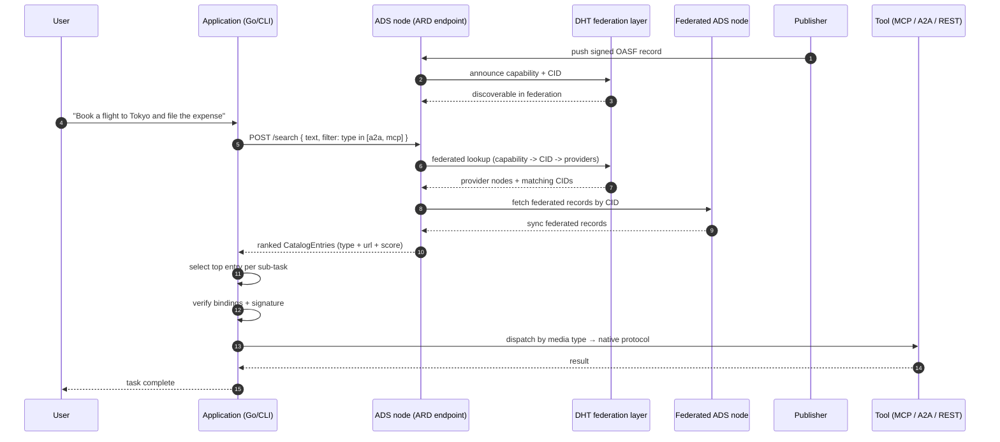

# Sample Apps built with Agent Directory

This directory contains sample applications that demonstrate how to use the Agent Discovery Service (ADS) to build multi-agent systems. Each sample includes a brief description, setup instructions, and code snippets to help you get started quickly.

## Applications

### [ARD over ADS](ard-over-ads/)

This sample application shows how to use the ARD protocol over the ADS service. It demonstrates how to start an ADS daemon, publish agent records, and perform discovery using ARD queries. Below is a sequence diagram showing a sample end-to-end flow, from discovery to invocation, across heterogeneous protocols. The idea is simple: an agentic application queries ADS over ARD, discovers capabilities, verifies trust, and dispatches work to the appropriate protocol based on its requirements. 

> This example is part of the **[ARD over Agent Directory: Interoperability by Design](https://blogs.agntcy.org/technical/2026/06/17/ai-catalog-over-directory.html)** blogpost.



**Running the example**

```bash
# Navigate to the sample directory
$ cd samples/ard-over-ads

# Run the example application
$ DIRECTORY_LOGGER_LOG_LEVEL=error go run main.go

Warning: identity verification failed for CID urn:ai:org.agntcy:cid:baeareih4otyowwzp7lao4y6eatxzlxdy734azaekx66r7sgq22dnqbnfo4: error_message:"no verification found"
Discovered and verified entry: urn:ai:org.agntcy:cid:baeareih4otyowwzp7lao4y6eatxzlxdy734azaekx66r7sgq22dnqbnfo4
Invoking Agent Skill: urn:ai:org.agntcy:cid:baeareih4otyowwzp7lao4y6eatxzlxdy734azaekx66r7sgq22dnqbnfo4
```
